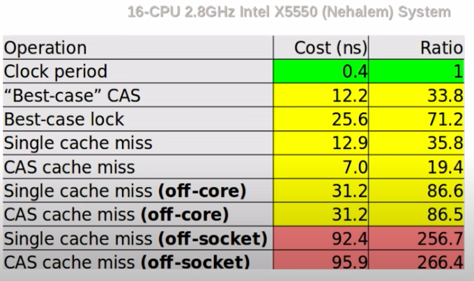
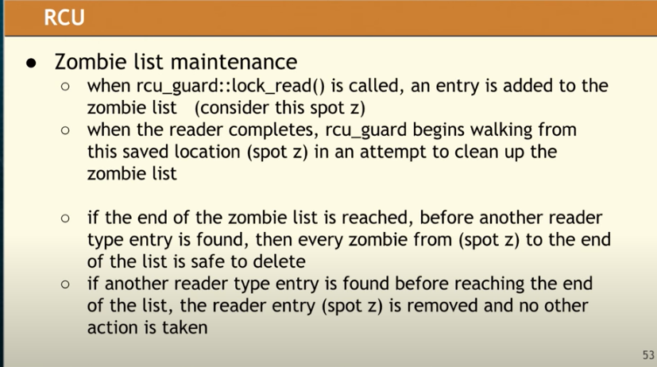

[toc]


## 2014

* make simple tasks simple!
  * being too clever is not clever: 太trick或需要思考的代码，后面维护的时候会导致至少、甚至更多的思绪——nightmare!
    * Design for clarity: 
      * 必要的 + 意外的
      * 尽量干掉后者：避免过度抽象、good interface（隔离好脏逻辑）
  
* [Leak-Freedom in C++... By Default.](https://www.youtube.com/watch?v=JfmTagWcqoE&t=780s)
  * pimpl使用const unique_ptr
  * Fixed-but-dynamic-size array: const unique_ptr<T[]>
  * 使用unique_ptr表示树时，可能会有析构时的stack overflow：n->child->child->chid->...->~Node()
  * don't own "upwards", 以避免loop。这个有点类似lock，don't pass an owner down to "unkown code" that might store it.
  
* [Data-Oriented Design](https://www.bilibili.com/video/BV12x411P7fU?p=2&vd_source=cd2e888c356719a0724eacfa14acabc8)  [知乎解读](https://zhuanlan.zhihu.com/p/34425262) 。

  * Lies:

    * Software is a platform——hardware is
    * code designed around model of the world——model只是我们对现实的模拟
    * code is more important than data

  * Cache 很重要

    * 耗时

      * L1~ 3cycle
      * L2 ~ 20cycles
      * Ram 200 cycles

    * 使用SOA(structures of array)代替AOS（array of structures）。这样要访问的数据都在一起

    * 注意数据排布。

      * ```c++
        struct {
          bool xxx; // 1
          bool yyy; // 2
          Mat mmm; // 4, 由于前面的数据，一个64cacheline无法一次性读完Mat，导致要获取两次
          bool zzz; // 68
        }
        ```

* [back to the basic](https://www.bilibili.com/video/BV12x411P7fU?p=5&vd_source=cd2e888c356719a0724eacfa14acabc8)

  * 如无理由，不要overthink——be default
  * pass by value and std::move inside: only for constructor 其他情况较少适用

* [Make Simple Tasks Simple - Bjarne Stroustrup](https://github.com/CppCon/CppCon2014/tree/master/Presentations/Make Simple Tasks Simple)

* [The Philosophy of Google’s C++ Style Guide](https://www.bilibili.com/video/BV12x411P7fU?p=19&vd_source=cd2e888c356719a0724eacfa14acabc8)

  * 代码规范是为了reader而非writer

* [Lock Free Programing](https://www.bilibili.com/video/BV12x411P7fU?p=44&vd_source=cd2e888c356719a0724eacfa14acabc8)

  * Double check：如果ptr是原子的，就没问题

    * ```c++
      atomic<T *> T::pInstance {nullptr};
      T * T::Instance() {
        T* p = pInstance; // 这里以及下面使用T*，减少一次atomic读。视频24:00左右
        if (nullptr == p) {
          lock_guard lg{mut_T};
          if (nullptr == (p = pIntance)) {
            pInstance = p = new T{};
          }
        }
        return p; // 这里的atomic读被优化掉了
      }
      ```
  
  * part 2。32:00左右：解决ABA问题（reader）；解决find（find的结果可能被pop删掉了）
  
    * ```c++
      template<typename T> class slist {
        struct Node{T t; shared_ptr<Node> next;}; // T* -> shared_ptr to solve ABA
        atomic<shared_patr<Node>> head;
      };
      ```
      
    * ABA问题：lock-free是计算后while(CAS)不断尝试。一般来说，这个值是地址。那么存在A地址被pop并释放后，新的对象复用了这个地址。那么问题的关键就是在CAS完成前，不要复用这个地址，即不要释放。
  
      * 办法有多个。part2 16:00
      * 其中有shared_ptr，另外由于是多线程，所以head得是atomic_shared_ptr
      * [stackoverflow](https://stackoverflow.com/questions/31277130/atomic-shared-ptr-for-lock-free-singly-linked-list) 上一篇讨论。
  
  * to improve scalability, we need to minimize the contention
  
    * reduce the size of critical sections
    * reduce sharing by isolating threads to use different parts of the data structure
      * moving cleanup from producer to consumer lets consumers touch only the head, producers touch only  the tail
    * reduce false sharing of different data on the same cache line, but adding alignment padding.
      * Separate variables that should be able to used concurrently by different threads should be far enough apart in memory
  
* [Walter E. Brown "Modern Template Metaprogramming: A Compendium, Part I"](https://www.youtube.com/watch?v=Am2is2QCvxY)


## 2016

* [A ＜chrono＞ Tutorial](https://www.youtube.com/watch?v=P32hvk8b13M&list=PLHTh1InhhwT7J5jl4vAhO1WvGHUUFgUQH&index=64)
  * 为啥要弄个库：
    * 10ms明确地表示10毫秒
    * 可以快速筛出代码中的时间，和其他用途的数字区分开。并快速切换单位，如s -> ms。f(seconds)
    * 灵活的时间转换比如 `frame = duration<int32_5, ratio<1,60>>`，输出时按ms进行cout
  * 什么时候需要time_point_cast和duration_cast: 隐式转换会丢信息时，比如1234ms->1s

* [tuple＜＞: What's New and How it Works](https://www.youtube.com/watch?v=JhgWFYfdIho&list=PLHTh1InhhwT7J5jl4vAhO1WvGHUUFgUQH&index=76)
  * 简化代码：字典序比较:`tie(a,b,c) < tie(other.a, other.b, other.c)`

* [Variants: Past, Present, and Future](https://www.youtube.com/watch?v=k3O4EKX4z1c&list=PLHTh1InhhwT7J5jl4vAhO1WvGHUUFgUQH&index=33)

  * ```c++
    template <typename LeafData>
    struct BinaryTree;
    
    template <typename LefeData>
    struct BinaryTreeBranch {
      shared_ptr<BinaryTree<LeafData>> left; // maybe unique_ptr better?
      shared_ptr<BinaryTree<LeafData>> left;
    };
    
    template <typename LeafData>
    struct BinaryTree {
      using Value = variant<LeafData, BinaryTreeBranch>;
      Value value;
    }
    ```

* [std::accumulate: Exploring an Algorithmic Empire](https://www.youtube.com/watch?v=B6twozNPUoA&list=PLHTh1InhhwT7J5jl4vAhO1WvGHUUFgUQH&index=37)

  * ```c++
    // 简化代码
    int sum;
    for (auto val : val_vec) {
      str += val;
    }
    // vs
    int sum = accumulate(val_vec.begin(), val_vec.end(), 0, [] (auto pre, auto s) {return pre + s;});
    // accumulate + associativity -> reduce
    int sum = reduce(val_vec.begin(), val_vec.end(), 0, [] (auto pre, auto s) {return pre + s;});
    ```

  * [monoids](https://www.cnblogs.com/richieyang/archive/2021/03/08/14323842.html) ——可以应用accumulate

    * Closure: 作用后依然是monoids
    * associativity: 结合律
    * Identity element: 有0元素
    * [Integer to Roman](https://leetcode.com/problems/integer-to-roman/) 。
      * `optional<To, From> func(From)`
    

* [Variadic expansion in examples](https://www.youtube.com/watch?v=Os5YLB5D2BU&list=PLHTh1InhhwT7J5jl4vAhO1WvGHUUFgUQH&index=47)

  * ```c++
    // 一个例子
    template <typename... Ts>
    auto double(variant<Ts...> v) {
      using visitor_t = void (*)(variant<Ts...>);
      static visitor_t handlers[] = {[](variant<Ts...> v) {
        using T = Ts;  // 获取当前的T
        cout << get<T>(v) + get<T>(v) << endl;
      }...};
      handlers[v.index()](v);
    }
    
    variant<int, float, string> d = "s";
    double(d);
    
    // 实现个variant的构造函数
    variant(const variant &other) : tag(other.tag) {
      using visitor_t = void (*)(variant & self, variant const &other);
      auto generator = [](auto type) {
        using Arg = typename decltype(type)::type;
        return [](cariant &self, const variant &other) {
          new (&self.storage) Arg(*reinterpret_cast<const Arg *>(&other.storage));
        };
      };
      static visitor_t copy_ctors[] = {generator(id<Ts>())...};
      copy_ctors[tag](*this, other);
    }
    
    ```

* [The Exception Situation](https://www.youtube.com/watch?v=Fno6suiXLPs&list=PLHTh1InhhwT7J5jl4vAhO1WvGHUUFgUQH&index=43)

  * 打日志是不可取的，程序出错了就不应该再以错误的状态跑下去
  * 可以考虑c风格的bool出参，或者进一步，c++17的optional、tuple。后者写起来很干净。不过会改掉原代码的api、会污染原本的code path
  * exception更干净：
    * 几乎不会对原代码有太多影响。api、code path等
    * 并且隔离开了disappointment detection和handling（detection处一般缺少如何正确handle的context）
    * 构造函数无返回值，只能走exception（或者两步init）
    * 除了极端情况（视频里就举了一个，且应该后来被修复了），exception都比其他方式性能好。当然exception比完全不处理还是会有些开销的，视频里说是3%
  * abseil
    * mutex提供了读写锁。debug模式下的dead lock
    
  


## 2017

* [“C++ as a "Live at Head" Language”](https://www.youtube.com/watch?v=tISy7EJQPzI&list=PLHTh1InhhwT6bwIpRk0ZbCA0N2p1taxd6&index=2)——SoftwareEngineeringAtGoogle有一章专门提了这个
  * Engineering is programming integrated over time（programming完成，engineerring维护）
  * engineering 和time强相关
    * vcs：可以回到某个历史
    * ci：最近的改动没有broken the system
    * ut：将来的代码别有问题
    * 重构：从旧到新
    * 设计模式：to plan for future changes without knowing exactly what it will be
    * 依赖管理：解决libraries的变化
  * 讲了下sematic version。想想都头疼。20:22
  * [hyrum law](https://www.hyrumslaw.com/): With a sufficient number of users of an API, it does not matter what you promise in the contract, all observable behaviors of your system will be depended on by somebody
  * 以下条目不要依赖std、或者其他代码（比如第三方库），应只限制在你自己的代码中。assume the "call only" interface
    * 不要forward declaration。可能他们版本升级后，和你的就不一致了。属于breaking change
    * 别依赖一个函数的地址。也是类似的。签名可能会变，比如加个overload的版本
    * 还有类似的就是meta programming/introspection on type properites。比如emplace_back的返回类型在c++17中就变了。
    * 不要依赖ADL。比如通过`absl::string_view`查找到`absel::StrCat`，然后`absl::string_view`在c++17版本下会是`std::string_view`的别名。这时候`absel::StrCat`就找不到了。
  
* [Herb Sutter “Meta: Thoughts on generative C++”](https://www.youtube.com/watch?v=4AfRAVcThyA&list=PLHTh1InhhwT6bwIpRk0ZbCA0N2p1taxd6&index=3)
  * 主要是如何让代码更简洁。以space operator切入，讲了一些想演进的语法
  
* [Matt Godbolt “What Has My Compiler Done for Me Lately? Unbolting the Compiler's Lid”](https://www.youtube.com/watch?v=bSkpMdDe4g4&list=PLHTh1InhhwT6bwIpRk0ZbCA0N2p1taxd6&index=5)
  * 一些汇编
  * compiler挺聪明的，O3太反直觉了
  * 乘法可能会改成shift；手写的shift可能会被替换成乘法：`a*65599=(a<<16) + (a<<6) - a`, 约24:00
  * 除法、取模也会做适当拆解成shift
  * 甚至会识别你的意图：
    * count二进制表示的1，直接替换成对应的指令
    * 求和1+2+..+n甚至会直接用`n*(n+1)/2`进行替换
  
* [Walter E. Brown “Programming with C++ Constraints: Background, Utility, and Gotchas"](https://www.youtube.com/watch?v=n4ie7tPMXOQ&list=PLHTh1InhhwT6bwIpRk0ZbCA0N2p1taxd6&index=7)
  * 以前：static_assert, enable_if, SFINAE
    * 比如求幂：先写个一般迭代，再写个终结的特化（可以用enable_if写的好看些）
  * c++17: constexpr if：不用再写SFINAE啦
  * c++20: Concept
  * 以swap为例——std要求T需要为movable type
    * movable=copyable || has-move-ops
  
* [Stephen Dewhurst “Modern C++ Interfaces..."](https://www.youtube.com/watch?v=PFdWqa68LmA&list=PLHTh1InhhwT6bwIpRk0ZbCA0N2p1taxd6&index=13)
  * 主要是怎么在模板编程里提供一个好的接口。通过trait去表达你的思想，你的各项要求、优化开关
  * Is_transparent: 可以参考[这个](https://www.fluentcpp.com/2017/06/09/search-set-another-type-key/)例子。简单来说，我们声明这个函数是transparent的，可以接受和容器KeyType不同的参数。此时会有另一组函数重载被开启。count`, `lower_bound`, `upper_bound` and `equal_range等
    * 后面的思想是，框架留好口子（SFINAE，`enable_if<T::SomeProperty>`）。我提供函数是，可以选择是否要使用这些口子，即定义`XXX::Someproperty`。——感觉就是type trait的一个形式
  * 37:00提举了个例子，不同c++标准下的实现。c++17的fold expression非常简洁
  * 24:18 当一个模板实例化后，其内部的模板函数可能发生非预期的匹配，因此要加上一些trait限制
  
    * ```c++
      template <typename T>
      class Heap {
        Heap(size t, T const&v);
        // range init. Heap<int>(5, 2)会命中这个构造函数, ooops
        // 因此加上using xxx = typename iterator_traits<It> ...
        // template<typename In, typename = IsIn<In>>
        template<typename In>
        Heap(In b, In e);
      };
      
      template<typename T>
      class X {
        void operaotr(T const&);
        void operaotr(T &&);
        // operator(T&)会命中这个
        // template <typename S, typename = NotSimilar<S,T>>
        template <typename S>	
        void operator(S&&);
      };
      ```
  
    * 
  
* [Ben Deane & Jason Turner “constexpr ALL the Things!”](https://www.youtube.com/watch?v=PJwd4JLYJJY&list=PLHTh1InhhwT6bwIpRk0ZbCA0N2p1taxd6&index=15)
  * [constexpr_all_the_things](http://github.com/lefticus/constexpr_all_the_things.git)。函数式编程+constexpr json
  
  * ```c++
    template <typename P, typename T, typename F>
    constexpr pair<T, parse_input_t> accumulate_parse(parse_input_t s, P &&p, T init, F &&f) 
    // Parser: optional<pair<To, From_remain>> parser(From);
    // Func: To func(To, From_remain)
    
    // 一个对数字的校验
    using parse_input_t = std::string_view;
    using parse_result_t = std::optional<std::pair<char, parse_input_t>>;
    template <class InputIt, class T>
    constexpr InputIt constexpr_find(InputIt first, InputIt last, const T &value) {
      for (; first != last; ++first) {
        if (*first == value) {
          return first;
        }
      }
      return last;
    }
    constexpr auto one_of(parse_input_t chars) {
      return [=](parse_input_t s) -> parse_result_t {
        if (s.empty()) return std::nullopt;
        // basic_string_view::find is supposed to be constexpr, but no...
        auto j = constexpr_find(chars.cbegin(), chars.cend(), s[0]);
        if (j != chars.cend()) {
          return parse_result_t(std::pair(s[0], parse_input_t(s.data() + 1, s.size() - 1)));
        }
        return std::nullopt;
      };
    }
    template <typename P>
    constexpr bool check_all(parse_input_t s, P &&p) {
      while (!s.empty()) {
        const auto r = p(s);
        if (!r) return false;
        s = r->second;
      }
      return true;
    }
    template <typename P>
    constexpr auto all_satisfy(P &&p) {
      return [p = std::forward<P>(p)](parse_input_t s) { return check_all(s, p); };
    }
    
    using namespace std::literals;
    template <typename T, T... Ts>
    constexpr auto operator"" _check() {
      const std::initializer_list<char> il{Ts...};
      // 对配置做个字符的校验，确保是以下之一
      constexpr auto parser = all_satisfy(one_of("01234567890,-|"sv));
    
      return parser(std::string_view(il.begin(), il.size()));
    }
    static_assert(R"(01234,566)"_check == true);
    
    ```
    
  * [Don't constexpr All the Things - David Sankel [CppNow 2021]](https://www.youtube.com/watch?v=NNU6cbG96M4) 
  
    * constexpr的依赖是传递性的，需要所有调用链上的都满足。这会极大限制constexpr的使用。
    * Core constant expressions(?) are too difficult to understand
    * One function implemented in two languages is error prone (constexpr and non-constepxr)
  
* [Carl Cook “When a Microsecond Is an Eternity: High Performance Trading Systems in C++”](https://www.youtube.com/watch?v=NH1Tta7purM&list=PLHTh1InhhwT6bwIpRk0ZbCA0N2p1taxd6&index=20)——一些性能tips

  * 配置化不一定需要特别多的虚函数，以多场景配置化举例：

    * ```c++
      // 3个虚函数表(XX_Base) vs 1个需函数表(ManagerBase)
      struct Manager{
        RecallBase *recall_;
        RankingBase *ranking_;
        RerankBase *rerank_;
        void DoRecommend();
      };
      
      template<typename Recall, typename Ranking, typename Rerank>
      struct Manager: public ManagerBase{
        Recall recall_;
        Ranking ranking_;
        Rerank rerank_;
        void DoRecommend() final;
      };
      ```

    * Don't be afaid to use exceptions(They are zero cost if they don't throw)

    * 对于latency，不建议使用multi-thread。如果要使用：

      * 减小data、考虑copy而非sharing、或许乱序也是可以接受的？

    * denormalized data：空间换时间，保证数据都在一个cache line中

    * 31:00 对比unordered_map。相比拉链法，开放地址法对cache更友好

    * 是否inline需要测试。if-else在inline后似乎无法进行分支预测的优化。强制是否inline应使用always_inlin和noinline

    * 保证data/instruction cache hot：正常流程很少会走到发出订单，因此用一些dummy请求来强制走到最后一步，但不发订单

    * 可以牺牲一些精度。

      * 另外，pow有些时候[会很慢](https://entropymine.com/imageworsener/slowpow/)，主要是base接近1.0的时候：pow(≈1.0, 1.4), pow(≈1.0, 1.5)

    * 如何测试耗时：搭建个测试链路，这个是最准的

    * 其他

      * inline语义逐渐发生变化：表示可以有多份定义 Because the meaning of the keyword inline for functions came to mean "multiple definitions are permitted" rather than "inlining is preferred", that meaning was extended to variables.

* [P. McKenney, M. Michael & M. Wong “Is Parallel Programming still hard? PART 1 of 2”](youtube.com/watch?v=YM8Xy6oKVQg&list=PLHTh1InhhwT6bwIpRk0ZbCA0N2p1taxd6&index=22)

  * triangle: productivity vs performance vs generality
  * Work Partitioning: greatly ↑performance, ↓productivity (更多complexity导致更难理解和debug)
  * ParallelAccessControl: ↓performance (比如：线程间同步的开销)
  * ResourcePartitioningAndReplication: ↓generality。数据冗余：disks、NUMA、CPU、GPU、cache lines。这冗余的形式往往和具体的领域强相关
  * InteractingWithHardware: ↓productivity，尤其是有portable要求时
  * 影响cpu的一些因素
  
    * mispredicted branch
    * memory reference？
    * RMW atomic
    * memory barrier, aka fence. memory ordering
    * cache miss
    * I/O operation
    * 
  * 一些优化及对应缺陷
  
    * big cacheline: 导致false sharing，解决办法是alignment
    * prefetching: 在拿line1时，顺便把line2拿了。又回到了big cacheline
    * store buffer: 将改动缓存起来，等cache来了再写进去。会导致mis-ordering
  * 一个例子及其分析：SingleProducerSingleComsumer。减少cache line bouncing
  
    * ```c++
      // lock使得其是串行的
      // lock存在cache line bouncing
      // lock的获取需要RMW或者fence
      // handoff per second 4.3M
      class SingleLock{
        T* buffer_[M];
        uint64_t head_{0};
      	uint64_t tail_{0};
        mutex lock_;
        bool TryEnq(T*) {
          lock_guard g{lock_};
          ...
        }
        T* TryDeq() {
          lock_guard g{lock_};
          ...
        }
      };
      
      // atomic是并行的，开销比lock小
      // 依然有cache line bouncing: head、tail被不用的线程读写
      // handoff per second 29.4M
      class Lamport1983{
        T* buffer_[M];
        atomic<uint64_t> head_{0}; // no lock, atomic instead of
        atomic<uint64_t> tail_{0};
        bool TryEnq(T*) {
      		uint64_t t = tail_.load(mo_rlx);
          if (head_.load(mo_acq) + M == t) ...;
          tail_.store(t+1, mo_rel); ...;
        }
        T* TryDeq() {
      		uint64_t h = head_.load(mo_rlx);
          if (tail_.load(mo_acq) == h) ...;
          head_.store(h+1, mo_rel); ...;
        }
      };
      // 将buffer改为atomic后，TryEnq和TyeDeq减少了cache line bouncing的问题：
      //   head_, tail_ 只会读其中的一个，不会两个都读
      // handoff per second: without alignment 27.0M
      // handoff per second: 58.8M
      class Giacomoni2008{
        atomic<T*> buffer_[M]; // this is atomic, and head,tail is not
        ALIGN_TO_AVOID_FALSE_SHARING size_t head_{0};
        ALIGN_TO_AVOID_FALSE_SHARING size_t tail_{0};
        bool TryEnq(T*) {
      		if (buffer_[tail_].load(mo_acq)) {return false;}
          buffer_[tail_].store(p,mo_real);
          tail_ = NEXT(t_); return true;
        }
        T* TryDeq() {
      		T *p = buffer_[head_].load(mo_acq);
          if (!p) return nullptr;
          buffer_[head_].store(nullptr, mo_rel);
          head_ = NEXT(head_); return p;
        }
      };
      
      // Blocking版本：使用condition variable
      // 对于使用condition variable的版本，性能偏差。其中一个可优化的细节是
      // 使用3个状态的Stat: Full, Empty, Blocked，只有Blocked时才需要进行wake操作
      ```
  
* [Victor Zverovich “A modern formatting library for C++”](youtube.com/watch?v=ptba_AqFYCM&list=PLHTh1InhhwT6bwIpRk0ZbCA0N2p1taxd6&index=26)

  * 如何打印map。细节接口后续再了解 https://godbolt.org/z/9KT9j6h1b
  
* [Allan Deutsch “Esoteric Data Structures and Where to Find Them”](youtube.com/watch?v=-8UZhDjgeZU&list=PLHTh1InhhwT6bwIpRk0ZbCA0N2p1taxd6&index=29)——一些数据结构

  * slot map。找到个[github](https://github.com/SergeyMakeev/slot_map)
    * slot {index, generation} -> data {}, freelist

  * bloom filter：m-bit长度，e可接受误差，k-hash函数个数，n元素个数
    * 误差$m = -1.44n * log_2(\epsilon); k = -log_2(\epsilon)$。即$m,k \propto log\epsilon$
    * TODO——bloom不支持删除，布谷？

  * Hash pointer: 存pointer时还存了对象的hash，确保hash是否有变过。好像是区块链里会用
  * 顺便提个HyperLogLog，[参考](https://www.yuque.com/abser/aboutme/nfx0a4)。用来估算总量。误差$1.04/\sqrt{m}$
    * 原理：hash足够均匀时，可以将二进制的0、1中，最高位1出现的位置视作伯努利过程。可以根据这个位置，反推存了多少个元素
    * 为了减少波动，会按bit位进行分桶，并取调和平均

* [Michael Park “Enhanced Support for Value Semantics in C++17”](https://www.youtube.com/watch?v=LmiDF2YheAM&list=PLHTh1InhhwT6bwIpRk0ZbCA0N2p1taxd6&index=30)

  * | value semantics      | optional<T>                                       | variant<Ts...> | any   |
    | -------------------- | ------------------------------------------------- | -------------- | ----- |
    | reference semantics  | T*                                                | AbstractBase*  | void* |
    | # of possible states | \|T\| + 1, <br />或者\|T\|？比如strol所有值都合法 | (... +\|Ts\|)  | 无限  |
  
    
  
  * optional
  
    * Magic number: 0、-1、npos。
  
      * 需要从值域中偷一个数，但不一定可以，比如strol都是合法值
  
      * 不在api中，需要人工校验
  
      * ```C++
        pid_t pid = fork();
        if (pid == 0) { // I'm child
          // ...
        } else {  // I'm parent: pid is child
          // ...
          kill(pid); // fork失败时会返回-1, kill(-1)会删除几乎所有进程，boom
        }
        ```
  
    * 使用场景：返回值、arg、成员变量
  
    * careful: nullopt_t 比任何T都小。最好不要进行optional<T>和T的比较。
  
    * ```c++
      optional<int> Car::get_speed() const; // 如果仪表失灵，则返回nullopt
      bool Car::can_accelerate () const {return get_speed() < MAX_SPEED;} // 仪表失灵后可无限加速
      ```
  
  * Variant——type-safe union
  
    * c++11：MPark.Variant
    * valueless_by_exception最好设个默认值，避免variant处于这个状态
  
  * any——type-safe void*。注意，这里是value语义，即deep copy
  
    * any_cast<T>会导致有临时对象，最好用ref，即any_cast<T&>，或者用指针，即any_cast<T>(&a)
  
* [Fedor Pikus “C++ atomics, from basic to advanced. What do they really do?”](youtube.com/watch?v=ZQFzMfHIxng&list=PLHTh1InhhwT6bwIpRk0ZbCA0N2p1taxd6&index=31)

  * 哪些类型可以作为atomic：trivially copyable, i.e., memcpy
  * x = x+1不是atomic的，x+=1是atomic的
  * 一个atomic类型是不是lock free的取决于platform和run-time
    * 可以用`constexpr is_always_lock_free`判断compile time的
    * 剩下的有些取决于runtime，主要是alignment原因

  * atomic可能比mutex慢的原因
    * atomic是share的，主要是读。（？mutex为啥没这个问题）
    * 可能有false sharing的问题

  * compare_exchange_weak/strong——spuriously fail
    * 在硬件层会有锁。获取锁在某些平台开销比较大，weak允许拿锁失败，即便`expect == *this`，即spuriously fail
    * Atomic variable as gateways to memory access
      * For acquiring exclusive access: 读到的其他线程提供的数据必须准备完毕，不能是中间状态
      * for releasing into shared access：自己准备的数据必须完毕，不能是中间状态

    * 一定要把memory order写出来：performance + 可读性
    * when to use atomic instead of lock
      * performance (measure)
      * difficult or expensive to implement with locks(list, trees)
      * drawbacks of locks are important(deadlocks, priority conflicts, latency prombelms)

* [Fedor Pikus “Read, Copy, Update, then what? RCU for non-kernel programmers”](youtube.com/watch?v=rxQ5K9lo034&list=PLHTh1InhhwT6bwIpRk0ZbCA0N2p1taxd6&index=75)

  * Lock-free solution: 很通用
  
  * read-write locks: updates are rare的场景。优化reader有overhead
  
  * RCU
    * 应用场景：低频写、对数据有容错（即wirter强制reuse、reclaim内存后，reader可以应对）、只能有一个writer？
  
    * reader、writer相互不阻塞
  
  * 随想：
    * 对于无锁队列：以MPXC为例
      * list的实现方式只需要准备好数据，然后update
  
      * 定长vec实现，需要分两步：先更新队列（deque/enque_pos），然后更新数据，并标志就绪（sequence）
  
    * 好像就是泛化版的double buffer
  
* [Sven Over “folly::Function: A Non-copyable Alternative to std::function”](youtube.com/watch?v=SToaMS3jNH0&list=PLHTh1InhhwT6bwIpRk0ZbCA0N2p1taxd6&index=36)

  * std::function的存储：48B: invoking-func-ptr, manager-func-ptr, 32B stored wrapped object（再大一些的改在堆上）
  * std::function的问题：
    * 只能处理copyable，move-only的无法处理（主要是function被copy时不好处理。不过我们很少copy std::function）
    * const不正确：operator()是const的，但是wrapped object是non-const的

  * folly::function的优势：——不过大小上涨了，64B。没啥特别的原因，cacheline友好算一个
    * 支持move-only的callables——这也就导致其无法被copy
    * non-copyable types 应当是 noexcept-movable——对容器的优化。所以folly::function是nonexcept-movable
    * const: `Function<void ()>, Function<void () const>` 。

* [Kostya Serebryany “Fuzz or lose...”](youtube.com/watch?v=k-Cv8Q3zWNQ&list=PLHTh1InhhwT6bwIpRk0ZbCA0N2p1taxd6&index=36)

  * 一个做自动化测试的库。看上去蛮有意思的。

  * 其他参考：[tutorial](https://github.com/google/fuzzing/blob/master/tutorial/libFuzzerTutorial.md)，搜到的一个[ppt](https://www.usenix.org/sites/default/files/conference/protected-files/enigma_slides_serebryany.pdf)。

  * macos:在macOs下，clang缺少库，brew能安装15版本，但是bazel会报找不到库的问题，不知道怎么设置。等后面mac升级到clang15再看看吧

    * ```bash
      brew install llvm
      /usr/local/opt/llvm/bin/clang
      clang++ -g -fsanitize=address,fuzzer fuzzing/tutorial/libFuzzer/fuzz_me.cc
      ```
      
    * [Bazelbuild/rules_fuzzing](https://github.com/bazelbuild/rules_fuzzing)

* [Robert Ramey “How to Write Effective Documentation for C++ Libraries...”](youtube.com/watch?v=YxmdCxX9dMk&list=PLHTh1InhhwT6bwIpRk0ZbCA0N2p1taxd6&index=38)

  * 问题：代码开发完后才写文档。两个问题：花时间（本身文档也不是那么好些）、还有可能发现bug要调整代码（但是这个时候已经进入进度尾声了，单测也有类似问题）
  * 办法
    * 开发时就写文档
    * 要简洁。

  * 内容格式参考
    * introduction - purpose of  the library
    * motivating example with explanation
    * notes
    * rationale
    * reference

* [Nicolai Josuttis “The Nightmare of Move Semantics for Trivial Classes”](youtube.com/watch?v=PNRju6_yn3o&list=PLHTh1InhhwT6bwIpRk0ZbCA0N2p1taxd6&index=40)

  * 对于string或者类似的，构造上要支持多个类型的，可以考虑pass-by-value。

  * ```c++
    struct Cust{
      string first;
      string last;
      int id;
    };
    
    Cust c{"Joe", "Fix", 42};
    Cust d{str, "Fix", 42};
    Cust e{move(s), "Fix", 42};
    // pass-by-value, 5alloc(4creat + 1cp + 5mv): 2cr+2mv, 1cp+1mv+1cr+1mv,1mv+1mv+1cr+1mv
    Cust::Cust(string f, string l ="", int = 0) :first(move(f)), last(move(l)), id(i) {}
    Cust::Cust(const char*) :first(f), last(""), id(i) {} // 处理Cust g = "nico";13:48。不能连转两次
    // pass-by-ref, the best, but too many overloads. 5malloc(4cr+1cp+1mv)
    // 主要是T const &和T&&的2x2组合；对于first、last两个字段，如果考虑Cust f{"nico"}，还得小心处理默认参数，不能造成ambiguous。10:59
    // 如果把char const*考虑进来，则不用担心默认参数，但是组合变成了3x3组合
    Cust::Cust(string const&f, string const&, int i= 0);  // 1
    Cust::Cust(string const&f, string &&l = "", int i= 0);  // 2
    Cust::Cust(string const&f, char const*l, int i= 0);  // 3
    Cust::Cust(string&&f, string const& l, int i= 0);  // 4
    Cust::Cust(string&&f, string&& l = "", int i= 0);  // 5
    Cust::Cust(string&&f, char const* l, int i= 0);  // 6
    Cust::Cust(char const* f, string const& l, int i= 0);  // 7
    Cust::Cust(char const* f, string && l = "", int i= 0);  // 8
    Cust::Cust(char const* f, const char *l, int i= 0);  // 9
    // 或者写模板，但是要考虑各种情况，需要写一些SFINAE
    // S2 = string: 为了处理Cust f{"Nico"};如果不指定默认参数，在推导数组时会报错。另外指定成const char*也有问题23:24
    // 第三个模板参数是为了处理Cust g{f};其中f也是一个Cust，因此要加个判断，避免处理<Cust&, string>
    // 如果不考虑继承，为了处理S1为右值，需要写为is_same_v<S1, Cust&>而非is_same_v<S1, Cust>
    // 如果要考虑继承，写为is_convertible_v<S1, Cust>。但这里逻辑有死循环：is_convertible依赖构造函数，而构造函数此时又依赖了is_convertible。因此改写为is_convertible_v<S1, string>
    template <typename S1, typename S2 = string, typename = enable_if_t<is_convertible_v<S1, string>>>
    Cust(S1&&f, S2&& l = "", int i = 0) : first(forward<S1>(f)), last(forward<S2>(l), id(i)){};
    ```

* [Nicolai Josuttis “C++ Templates Revised”](youtube.com/watch?v=ULX_VTkMvf8&list=PLHTh1InhhwT6bwIpRk0ZbCA0N2p1taxd6&index=72)

  * ``` c++
    // 捕获
    inline constexpr auto isValid = [](auto f) {
      return [](auto && ...args) { // 不需要对f进行捕获，因为后面是用在decltype中：unevaluated context 19:56
        return decltype(isValidImpl<decltype(f), decltype(args) &&...> (nullptr)){};
      }
    }
    // 顺序
    remove_reference_t<remove_const_t<onst int&>; // const int
    remove_const_t<remove_reference_t<onst int&>; // int
    // 考虑value category  23:39
    is_copy_assignable_t<int>; // true
    is_assignable_t<int, int>; // false, 42 = 42
    is_assignable_t<int&, int>; // ok
    // 	&collapse
    // 		T& &	-> T&
    // 		T& && -> T&
    // 		T&& & -> T&
    // 		T&& &&-> T&&
    // 	decltype(auto) 33:08
    //		prvalue: 	T
    //		lvalue: 	T&
    //		xvalue:	 	T&&
    
    // 模板参数可以传const char*, 但是要求w/o linkage——啥意思？24:35
    template <typename T, auto S> // S for const char*
    class AddSuf {};
    void func() {
      static const char suffix [] = ", "; // 注意，是数组，而不是const char*
    	cout<<AddSuf<sufix>; // 可以传字符串
    }
    
    // return应为auto，不能为T, 比如传string_view时，可能会有问题。我们需要func(sv,sv)->string，重载了op+。45:58
    // 顺带说下sv导致AlmostAlwaysAuto broken。auto const&对于string或延长生命周期，但是对于sv无法阻止数据的释放
    string operator+(string_view, string view); // 这里重载后，sv+sv返回string
    template<typename T>
    auto double_x(T& x); // 需要deduction guide处理下"xxxxx"字符串
    // 通过decltype保留右值
    template<typename T>
    decltype(auto) call(T& x) {
      if constexpr (/*return type is void*/) {return ;}
      else { 
        decltype(auto) ret = invoke...;
        return ret; // 注意，这里不要return (ret);否则decltype(auto) = call会变成T&
      }
    }
    ```
    
  * 

* [Arthur O'Dwyer “dynamic_cast From Scratch”](youtube.com/watch?v=QzJL-8WbpuU&list=PLHTh1InhhwT6bwIpRk0ZbCA0N2p1taxd6&index=45)

  * dynamic_cast的一个实现。可以用来复习c++的对象存储方式

* [Ansel Sermersheim “Multithreading is the answer. What is the question?](youtube.com/watch?v=GNw3RXr-VJk&list=PLHTh1InhhwT6bwIpRk0ZbCA0N2p1taxd6&index=48)

  * 提到了一个库[CopperSpice](https://www.copperspice.com/about.html)，不知道是否有用，可以留意下。好像后面的cppcon和cppnew都会再提及

  * race condition: a resource is accessed by multiple threads simultaneously, and at least one is a write

  * 一些建议：

    * 避免太多线程（one active thread per core is ideal）
    * 将阻塞calls挪到异步线程中
    * 减少shared data——减少通讯、race condition

  * 一些CR

    * map需要考虑元素删除的问题，否则会一直增长下去

  * ```c++
    // shared_guared 12:12
    // 类似Rust里的Mutex，把锁和对象绑在一起，避免拆开使用
    template<typename T, typename M = shared_timed_mutex>
    class shared_guared{
     public:
      using handle = unique_ptr<T, deleter>;
      
      template<typename ...Us>
      shared_guared(Us &&...data) : forward<Us>() {}
      
      handle shared_lock() const;
      handle lock() {
        unique_lock<M> lock(mutex_);
        return handle(&m_obj, deleter(move(mutex_)));
      }
     private:
      class deleter {
       public:
        using pointer = T*;
        deleter(unique_lock<M> lock) : lock_(move(lock)) {}
        
        void operator()(T* ptr) {
          if (lock_.owns_lock()) {
            lock_.unlock();
          }
        }
       private:
        unique_lock<M> lock_;
      };
      shared_mutex mutex_;
    };
    
    class MyCache {
      using ValType = shared_ptr<int>;
      // const 避免了读写锁时，只读+[]导致的多线程问题
      ValType lookup(string key) const {
        // to finish 
      }
      
     private:
      shared_guared<map<string, ValType>> cache_;
    };
    ```

  * [cppnow](https://www.youtube.com/watch?v=rNHLp44rMSs)_——没咋细看，后面有需要再研究

    * CsLibGuarded

    * 提到了一个RCU的算法——ReadCopyUpdate。多线程读写时，写不阻塞读，只阻塞写。29:00

    * 写很直观，类似compare_exchange_weak，主要是什么时候去删节点：

      * 

    * ```c++
      struct zombie_list_node {
        atomic<zombie_list_node*> next;
        node *zombie_node;
        atomic<rcu_guard*> read_in_process; // 第四步中的remove entry是将该指针置nullptr
      }
      ```

    * 这里reader执行了reclaim memory，会对性能有些影响：Fedor Pikus 48:52

* [Alisdair Meredith “Recreational C++”](youtube.com/watch?v=ovxNM865WaU&list=PLHTh1InhhwT6bwIpRk0ZbCA0N2p1taxd6&index=50)

  * 过了下`std::is_function, std::is_arithmetic`的实现

  * [Eric Niebler](https://stackoverflow.com/questions/43470741/how-does-eric-nieblers-implementation-of-stdis-function-work)的实现。挺有意思的，但是有bug：an array of incomplete class会被错误识别为function

    * ```c++
      // 使用priority_tag来进行tag_dispatch. 派生类比基类可用范围更窄，即SFINAE优先级更高
      // 这样可以实现函数重载的优先级顺序
      // 函数签名为char (xx) [#],即返回类型为char[#]. 这样后面就可以通过sizeof进行判断
      // decltype((*(T*)0)[0])等价于std::declval<T>()[0], 或者std::is_array<T>
      //    * 前者需要多敲写代码（？个人感觉还短些）
      //    * 后者的话会导致实例化一个模板，可能导致代码膨胀
      //    * 字面意思是：将0强转为T*, 然后deref,庵后index
      
      template<int I> struct priority_tag : priority_tag<I - 1> {};
      template<> struct priority_tag<0> {};
      
      // Function types here:
      template<typename T>
      char(&is_function_impl_(priority_tag<0>))[1];
      
      // Array types here:
      template<typename T, typename = decltype((*(T*)0)[0])>
      char(&is_function_impl_(priority_tag<1>))[2];
      
      // Anything that can be returned from a function here (including
      // void and reference types):
      template<typename T, typename = T(*)()>
      char(&is_function_impl_(priority_tag<2>))[3];
      
      // Classes and unions (including abstract types) here:
      template<typename T, typename = int T::*>
      char(&is_function_impl_(priority_tag<3>))[4];
      
      template <typename T>
      struct is_function
          : std::integral_constant<bool, sizeof(is_function_impl_<T>(priority_tag<3>{})) == 1>
      {};
      
      // 另一个版本, 函数指针不能是const、也不能是ref
      template<typename T>
      constexpr bool is_func_v = !is_const_v<const T> and !is_reference_V<T>;
      
      //// is_arithmetic ////
      // 对于arithmetic类型，无法重载unary +
      template<typename T>
      void operator+(T);
      
      template<typename T, typename = void>
      constepxr bool is_arithmetic_v = false;
      
      template<typename T, 
      	void_t<
          decltype(+T{})& // 对于可用重载的，这里返回类型为void, void不能&
          decltype(T{} * T{}) // filter: pointer or array
          decltype(T{} % 1) // filter: float
        >
      >
      constepxr bool is_arithmetic_v = true;
      
      //// get ////
      template<typename ...>
      struct tuple_imp;
      
      // 这里index_sequence的签名和std的不符合呀，是不是ppt里有笔误
      // 之所以要wrap<Index, Types>而不是直接Types是因为可能有重复的类型，但基类不能重复
      template<size_t ...Index, typename ... Types>
      struct tuple_imp<index_sequence<Index..., Types ...> : wrap<Index,Types>... {};
      
      template<typename...Types>
      struct tuple : tuple_imp<index_sequence_for<Types...>, Types...> {};
      
      template <size_t N, typename T>
      struct wrap { ...operator() ...{return value;} };
      
      template <size_t N, typename N>
      constexpr auto access(Wrap<N, Type> &x) noexcept -> Type & {return x;}
      
      template <size_t N, typename ...Types>
      constexpr auto get(Tuple<Types...> &x) noexcept -> tuple_ement_t<N, Tuple<Types>> & {
        return access<N>(x);  // 注意，这里通过引用切到了基类
      }
      ```

* [Tony Van Eerd “Postmodern C++”](youtube.com/watch?v=QTLn3goa3A8&list=PLHTh1InhhwT6bwIpRk0ZbCA0N2p1taxd6&index=58)
  * 说实话不是特别明白在说啥，但是押韵挺有意思的——主要是思想方式
  * 代码要注重isolation。比如代码抽成函数，让我们更聚焦当前这小部分逻辑
  * 代码的一些抉择取决于context与对象。比如error handling虽然有exception、error code、logging、termination、user message等方法。但用哪一个取决于你要交流的对象，比如library author、calling developer还是end user。

* [Jason Turner “Practical C++17”](youtube.com/watch?v=nnY4e4faNp0&list=PLHTh1InhhwT6bwIpRk0ZbCA0N2p1taxd6&index=58)——一些新特性的介绍
  * structure binding、if/switch init、fold expression、if constexpr、string_view、emplace_back
  * noexcept现在是类型签名的一部分，类似const
  * NRVO无法用于subobject，即pair<int, string> 在返回.second时需要加move，否则直接return会有copy。structure binding不能解决这一问题。

* [Titus Winters “Hands-On With Abseil”](youtube.com/watch?v=xu7q8dGvuwk&list=PLHTh1InhhwT6bwIpRk0ZbCA0N2p1taxd6&index=60)
  * 避免使用过长的namespace。从可读性上来说，最好只有1层；另外，名字应更具可读性——比如`foo::file::SetContents -> boo::SetFileContests`

* [John Lakos “Local ('Arena') Memory Allocators](youtube.com/watch?v=nZNd5FjSquk&list=PLHTh1InhhwT6bwIpRk0ZbCA0N2p1taxd6&index=74)

  * pmr可以让不同alloctor的对象放在一个容器、函数里。即不影响类型系统
  * vitual和inline语义上有些矛盾。因此，对于按指针访问时，inline会被忽略掉；但如果按对象访问，则是inline替换
  * Density, Variation——维度补充下
    * D+V  benchmark在高Utilization、无多线程Contention时: globle > Multipool > multipool<Mono> > Monotonic
    * Locality: 如果多个线程，不断地从一个线程pop并push到另一个线程，会导致diffusion，即不同线程的memory交织在一起，cache不友好、且会出现false sharing。如果缺少local分配器时，会出现这种情况
      * 
      * 这个和fragement不一样，内存碎片是内存散落在各处，无法有效利用
      * 
      * 解决办法是使用thread local的对象池。另外，可能要考虑数据copy，避免slice（例子里是list）导致需要访问的内存分在在各处

* [John Regehr “Undefined Behavior in 2017](youtube.com/watch?v=v1COuU2vU_w&list=PLHTh1InhhwT6bwIpRk0ZbCA0N2p1taxd6&index=77)

  * Somebody once told me that in basketball you can't hold the ball and run. I got a basketball and tried it and it worked just fine. He obviously didn't understand basketball.——一个joke

  * ub可能现在没问题，但是随着compiler、compiler version、optimization level、platform改变而暴露出来

  * ub时，程序可能当场就挂、或者跑到后面再挂、甚至代码语义变更

  * ```c++
    // debug或compiler优化时，ub会导致程序语义变更。下面的例子用gcc -O2进行编译
    
    // 由于printf在p为null时是ub。所以compiler会假定p不为空，会优化掉if(p)
    void foo(char *p) {
        // printf("%s\n",p); debug时开/关这块代码
       if (p) { *p=5;}
    }
    // p、q中任意一个指针为null，会导致ub。因为assemble代码只有一行，优化掉了if(!q)的判断。30:55
    void foo(int *p, int *q, size_t n) {
      memcpy(p,q,n); // jmp memcpy
      // 被优化掉了，因为它假定p、q如果为null时，memcpy会挂，即便n为0。
      // 可能的场景：for循环最后一次loop
      if (!q) {abort();} 
    }
    ```

* [Scott Schurr “Type Punning in C++17: Avoiding Pun-defined Behavior”](youtube.com/watch?v=sCjZuvtJd-k&list=PLHTh1InhhwT6bwIpRk0ZbCA0N2p1taxd6&index=79)

  * ```c++
    // 使用invalid pointer是ub
    // 使用uintptr_t来接指针, 其提供了**足够大**的类型来接p
    // 但是我们应该用指针p来进行加减，而不是ip。因为后者不保证有valid pointer——不过大部分情况下都没问题
    auto ip = reinterpret_cast<uintptr_t> (p);
    ```

  * 只能用`char*/unsigned char*`或者`std::byte`（推荐后者）来访问对象bit

  * 访问union的非active对象在c++17里是ub


## 2022

* [C++ in Constrained Environments](https://www.youtube.com/watch?v=2BuJjaGuInI&list=PLHTh1InhhwT6c2JNtUiJkaH8YRqzhU7Ag&index=145)
  * language is just a part of developer's toolbox
  * All problems in computer science can be solved by another level of indirection, except for the problem of too many layers of indirection—— [Butler Lampson](https://en.wikipedia.org/wiki/Butler_Lampson)。https://en.wikipedia.org/wiki/Indirection
  * variant 比union好：express its intent
  * error code vs exception
    * error code
      * a failure is normal and expected
      * an immediate caller can reasonably be expected to handle the failure
      * an error happens in one of a set of parallel tasks and we need to know which task failed
* [Can C++ be 10x Simpler & Safer? ](https://www.youtube.com/watch?v=ELeZAKCN4tY)——cppfront