[toc]


# 2017

## [“C++ as a "Live at Head" Language”](https://www.youtube.com/watch?v=tISy7EJQPzI&list=PLHTh1InhhwT6bwIpRk0ZbCA0N2p1taxd6&index=2)——SoftwareEngineeringAtGoogle有一章专门提了这个

* Engineering is programming integrated over time（programming完成，engineerring维护）
* engineering 和time强相关
  * vcs：可以回到某个历史
  * ci：最近的改动没有broken the system
  * ut：将来的代码别有问题
  * 重构：从旧到新
  * 设计模式：to plan for future changes without knowing exactly what it will be
  * 依赖管理：解决libraries的变化
* 讲了下sematic version。想想都头疼。20:22
* [hyrum law](https://www.hyrumslaw.com/): With a sufficient number of users of an API, it does not matter what you promise in the contract, all observable behaviors of your system will be depended on by somebody
* 以下条目不要依赖std、或者其他代码（比如第三方库），应只限制在你自己的代码中。assume the "call only" interface
  * 不要forward declaration。可能他们版本升级后，和你的就不一致了。属于breaking change
  * 别依赖一个函数的地址。也是类似的。签名可能会变，比如加个overload的版本
  * 还有类似的就是meta programming/introspection on type properites。比如emplace_back的返回类型在c++17中就变了。
  * 不要依赖ADL。比如通过`absl::string_view`查找到`absel::StrCat`，然后`absl::string_view`在c++17版本下会是`std::string_view`的别名。这时候`absel::StrCat`就找不到了。

## [Herb Sutter “Meta: Thoughts on generative C++”](https://www.youtube.com/watch?v=4AfRAVcThyA&list=PLHTh1InhhwT6bwIpRk0ZbCA0N2p1taxd6&index=3)

* 主要是如何让代码更简洁。以space operator切入，讲了一些想演进的语法

## [Matt Godbolt “What Has My Compiler Done for Me Lately? Unbolting the Compiler's Lid”](https://www.youtube.com/watch?v=bSkpMdDe4g4&list=PLHTh1InhhwT6bwIpRk0ZbCA0N2p1taxd6&index=5)

* 一些汇编
* compiler挺聪明的，O3太反直觉了
* 乘法可能会改成shift；手写的shift可能会被替换成乘法：`a*65599=(a<<16) + (a<<6) - a`, 约24:00
* 除法、取模也会做适当拆解成shift
* 甚至会识别你的意图：
  * count二进制表示的1，直接替换成对应的指令
  * 求和1+2+..+n甚至会直接用`n*(n+1)/2`进行替换

## [Carl Cook “When a Microsecond Is an Eternity: High Performance Trading Systems in C++”](https://www.youtube.com/watch?v=NH1Tta7purM&list=PLHTh1InhhwT6bwIpRk0ZbCA0N2p1taxd6&index=20)——一些性能tips

* 配置化不一定需要特别多的虚函数，以多场景配置化举例：

  * ```c++
    // 3个虚函数表(XX_Base) vs 1个需函数表(ManagerBase)
    struct Manager{
      RecallBase *recall_;
      RankingBase *ranking_;
      RerankBase *rerank_;
      void DoRecommend();
    };
    
    template<typename Recall, typename Ranking, typename Rerank>
    struct Manager: public ManagerBase{
      Recall recall_;
      Ranking ranking_;
      Rerank rerank_;
      void DoRecommend() final;
    };
    ```

  * Don't be afaid to use exceptions(They are zero cost if they don't throw)

  * 对于latency，不建议使用multi-thread。如果要使用：

    * 减小data、考虑copy而非sharing、或许乱序也是可以接受的？

  * denormalized data：空间换时间，保证数据都在一个cache line中

  * 31:00 对比unordered_map。相比拉链法，开放地址法对cache更友好

  * inline/noinline对性能的影响需要测试。强制是否inline应使用always_inlin和noinline

    * `if(Foo()) {} else{}`编译器可能将Foo进行inline，考虑到分支预测，可能在icache中，在hotpath上污染了一些non-hotpath

  * 保证data/instruction cache hot：正常流程很少会走到发出订单，因此用一些dummy请求来强制走到最后一步，但不发订单

  * 可以牺牲一些精度。

    * 另外，pow有些时候[会很慢](https://entropymine.com/imageworsener/slowpow/)，主要是base接近1.0的时候：pow(≈1.0, 1.4), pow(≈1.0, 1.5)

  * 如何测试耗时：搭建个测试链路，这个是最准的

  * 其他

    * inline语义逐渐发生变化：表示可以有多份定义 Because the meaning of the keyword inline for functions came to mean "multiple definitions are permitted" rather than "inlining is preferred", that meaning was extended to variables.

## [P. McKenney, M. Michael & M. Wong “Is Parallel Programming still hard? PART 1 of 2”](https://www.youtube.com/watch?v=YM8Xy6oKVQg&list=PLHTh1InhhwT6bwIpRk0ZbCA0N2p1taxd6&index=23)

* triangle: productivity vs performance vs generality

* Work Partitioning: greatly ↑performance, ↓productivity (更多complexity导致更难理解和debug)

* ParallelAccessControl: ↓performance (比如：线程间同步的开销)

* ResourcePartitioningAndReplication: ↓generality。数据冗余：disks、NUMA、CPU、GPU、cache lines。这冗余的形式往往和具体的领域强相关

* InteractingWithHardware: ↓productivity，尤其是有portable要求时

* 影响cpu的一些因素

  * mispredicted branch
  * memory reference？
  * RMW atomic
  * memory barrier, aka fence. memory ordering
  * cache miss
  * I/O operation
  * 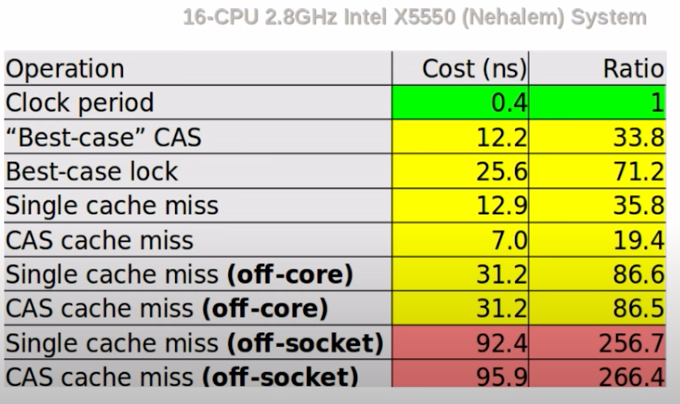

* 一些优化及对应缺陷

  * big cacheline: 导致false sharing，解决办法是alignment
  * prefetching: 在拿line1时，顺便把line2拿了。又回到了big cacheline
  * store buffer: 将改动缓存起来，等cache来了再写进去。会导致mis-ordering

* 一个例子及其分析：SingleProducerSingleComsumer。减少cache line bouncing

  * ```c++
    // lock使得其是串行的
    // lock存在cache line bouncing
    // lock的获取需要RMW或者fence
    // handoff per second 4.3M
    class SingleLock{
      T* buffer_[M];
      uint64_t head_{0};
    	uint64_t tail_{0};
      mutex lock_;
      bool TryEnq(T*) {
        lock_guard g{lock_};
        ...
      }
      T* TryDeq() {
        lock_guard g{lock_};
        ...
      }
    };
    
    // atomic是并行的，开销比lock小
    // 依然有cache line bouncing: head、tail被不用的线程读写
    // handoff per second 29.4M
    class Lamport1983{
      T* buffer_[M];
      atomic<uint64_t> head_{0}; // no lock, atomic instead of
      atomic<uint64_t> tail_{0};
      bool TryEnq(T*) {
    		uint64_t t = tail_.load(mo_rlx);
        if (head_.load(mo_acq) + M == t) ...;
        tail_.store(t+1, mo_rel); ...;
      }
      T* TryDeq() {
    		uint64_t h = head_.load(mo_rlx);
        if (tail_.load(mo_acq) == h) ...;
        head_.store(h+1, mo_rel); ...;
      }
    };
    // 将buffer改为atomic后，TryEnq和TyeDeq减少了cache line bouncing的问题：
    //   head_, tail_ 只会读其中的一个，不会两个都读
    // handoff per second: without alignment 27.0M
    // handoff per second: 58.8M
    class Giacomoni2008{
      atomic<T*> buffer_[M]; // this is atomic, and head,tail is not
      ALIGN_TO_AVOID_FALSE_SHARING size_t head_{0};
      ALIGN_TO_AVOID_FALSE_SHARING size_t tail_{0};
      bool TryEnq(T*) {
    		if (buffer_[tail_].load(mo_acq)) {return false;}
        buffer_[tail_].store(p,mo_real);
        tail_ = NEXT(t_); return true;
      }
      T* TryDeq() {
    		T *p = buffer_[head_].load(mo_acq);
        if (!p) return nullptr;
        buffer_[head_].store(nullptr, mo_rel);
        head_ = NEXT(head_); return p;
      }
    };
    
    // Blocking版本：使用condition variable
    // 对于使用condition variable的版本，性能偏差。其中一个可优化的细节是
    // 使用3个状态的Stat: Full, Empty, Blocked，只有Blocked时才需要进行wake操作
    ```


## [Allan Deutsch “Esoteric Data Structures and Where to Find Them”](youtube.com/watch?v=-8UZhDjgeZU&list=PLHTh1InhhwT6bwIpRk0ZbCA0N2p1taxd6&index=29)——一些数据结构

* slot map。找到个[github](https://github.com/SergeyMakeev/slot_map)
  * slot {index, generation} -> data {}, freelist

* bloom filter：m-bit长度，e可接受误差，k-hash函数个数，n元素个数
  * 误差$m = -1.44n * log_2(\epsilon); k = -log_2(\epsilon)$。即$m,k \propto log\epsilon$
  * TODO——bloom不支持删除，布谷？

* Hash pointer: 存pointer时还存了对象的hash，确保hash是否有变过。好像是区块链里会用
* 顺便提个HyperLogLog，[参考](https://www.yuque.com/abser/aboutme/nfx0a4)。用来估算总量。误差$1.04/\sqrt{m}$
  * 原理：hash足够均匀时，可以将二进制的0、1中，最高位1出现的位置视作伯努利过程。可以根据这个位置，反推存了多少个元素
  * 为了减少波动，会按bit位进行分桶，并取调和平均

## [Michael Park “Enhanced Support for Value Semantics in C++17”](https://www.youtube.com/watch?v=LmiDF2YheAM&list=PLHTh1InhhwT6bwIpRk0ZbCA0N2p1taxd6&index=30)

* | value semantics      | optional<T>                                       | variant<Ts...> | any   |
  | -------------------- | ------------------------------------------------- | -------------- | ----- |
  | reference semantics  | T*                                                | AbstractBase*  | void* |
  | # of possible states | \|T\| + 1, <br />或者\|T\|？比如strol所有值都合法 | (... +\|Ts\|)  | 无限  |

* optional

  * Magic number: 0、-1、npos。

    * 需要从值域中偷一个数，但不一定可以，比如strol都是合法值

    * 不在api中，需要人工校验

    * ```C++
      pid_t pid = fork();
      if (pid == 0) { // I'm child
        // ...
      } else {  // I'm parent: pid is child
        // ...
        kill(pid); // fork失败时会返回-1, kill(-1)会删除几乎所有进程，boom
      }
      ```

  * 使用场景：返回值、arg、成员变量

  * careful: nullopt_t 比任何T都小。最好不要进行optional<T>和T的比较。

  * ```c++
    optional<int> Car::get_speed() const; // 如果仪表失灵，则返回nullopt
    bool Car::can_accelerate () const {return get_speed() < MAX_SPEED;} // 仪表失灵后可无限加速
    ```

* Variant——type-safe union

  * c++11：MPark.Variant
  * valueless_by_exception最好设个默认值，避免variant处于这个状态

* any——type-safe void*。注意，这里是value语义，即deep copy

  * any_cast<T>会导致有临时对象，最好用ref，即any_cast<T&>，或者用指针，即any_cast<T>(&a)

## [Fedor Pikus “C++ atomics, from basic to advanced. What do they really do?”](https://www.youtube.com/watch?v=ZQFzMfHIxng&list=PLHTh1InhhwT6bwIpRk0ZbCA0N2p1taxd6&index=32)

* 哪些类型可以作为atomic：trivially copyable, i.e., memcpy

* x = x+1不是atomic的，x+=1是atomic的

* 一个atomic类型是不是lock free的取决于platform和run-time

  * 可以用`constexpr is_always_lock_free`判断compile time的
  * 剩下的有些取决于runtime，主要是alignment原因

* atomic可能比mutex慢的原因

  * atomic是share的，主要是读。（？mutex为啥没这个问题）
  * 可能有false sharing的问题

* compare_exchange_weak/strong——spuriously fail

  * 在硬件层会有锁。获取锁在某些平台开销比较大，weak允许拿锁失败，即便`expect == *this`，即spuriously fail

    * cpu socket timing-out

    * Spurious fail疑惑点：35:00

      * expect == real，但返回false

      * 它是否知道real的值？知道：那为啥不swap；不知道：它要修改expect为real，以便下次迭代，矛盾。

      * 实际上，分为两步，read+write。spuriously fail是write失败了

      * ```c++
        bool compare_exchange_strong_weak (T &old_v, T new_v) {
          // double-checked locking pattern
          T tmp = value.load(); // current value of the atomic
          if (tmp != old_v) {old_v = tmp; return false;}
          
          // strong
          Lock L;
          // weak
          TimedLock L;
          if (!L.locked()) {return false;}
          
          tmp = value.load();
          if (tmp != old_v) {old_v = tmp; return false;}
          
          value = new_v;
          return true;
        }
        ```

      * 

  * Atomic variable as gateways to memory access

    * For acquiring exclusive access: 读到的其他线程提供的数据必须准备完毕，不能是中间状态
    * for releasing into shared access：自己准备的数据必须完毕，不能是中间状态

  * 一定要把memory order写出来：performance + 可读性

  * when to use atomic instead of lock

    * performance (measure)
    * difficult or expensive to implement with locks(list, trees)
    * drawbacks of locks are important(deadlocks, priority conflicts, latency prombelms)

## [Arthur O'Dwyer “dynamic_cast From Scratch”](youtube.com/watch?v=QzJL-8WbpuU&list=PLHTh1InhhwT6bwIpRk0ZbCA0N2p1taxd6&index=45)

* dynamic_cast的一个实现。可以用来复习c++的对象存储方式

## [John Regehr “Undefined Behavior in 2017](youtube.com/watch?v=v1COuU2vU_w&list=PLHTh1InhhwT6bwIpRk0ZbCA0N2p1taxd6&index=77)

* Somebody once told me that in basketball you can't hold the ball and run. I got a basketball and tried it and it worked just fine. He obviously didn't understand basketball.——一个joke

* ub可能现在没问题，但是随着compiler、compiler version、optimization level、platform改变而暴露出来

* ub时，程序可能当场就挂、或者跑到后面再挂、甚至代码语义变更

* ```c++
  // debug或compiler优化时，ub会导致程序语义变更。下面的例子用gcc -O2进行编译
  
  // 由于printf在p为null时是ub。所以compiler会假定p不为空，会优化掉if(p)
  void foo(char *p) {
      // printf("%s\n",p); debug时开/关这块代码
     if (p) { *p=5;}
  }
  // p、q中任意一个指针为null，会导致ub。因为assemble代码只有一行，优化掉了if(!q)的判断。30:55
  void foo(int *p, int *q, size_t n) {
    memcpy(p,q,n); // jmp memcpy
    // 被优化掉了，因为它假定p、q如果为null时，memcpy会挂，即便n为0。
    // 可能的场景：for循环最后一次loop
    if (!q) {abort();} 
  }
  ```

* [Piotr Padlewski “Undefined Behaviour is awesome!”](https://www.youtube.com/watch?v=ehyHyAIa5so&list=PLHTh1InhhwT6bwIpRk0ZbCA0N2p1taxd6&index=136)。一个类似的讲ub的。

  * deref nullptr是ub。compiler的一个处理办法是把代码标位unreachable，然后对代码进行删减

  * ```c++
    // main.cpp
    using Fun = void();
    static Fun *fun_ptr;
    void evil() { /*rm something*/ }
    void set() {fun_ptr = evil;}
    int main() {fun_ptr();} // evil会被inline到main中。24:13
    
    // 忘了return 30:09
    int foo(bool p) {
      if (p) {return 42;}
    }
    int foo(bool p) {return 42;}
    
    // 53:46提到了个bug，导致while中的retry被移除
    while (!p && --retry) {
      p = new int(2);
    }
    *p = 1;
    ```

* [Scott Schurr “Type Punning in C++17: Avoiding Pun-defined Behavior”](https://www.youtube.com/watch?v=sCjZuvtJd-k&list=PLHTh1InhhwT6bwIpRk0ZbCA0N2p1taxd6&index=80)

  * ```c++
    // 使用invalid pointer是ub
    // 使用uintptr_t来接指针, 其提供了**足够大**的类型来接p
    // 但是我们应该用指针p来进行加减，而不是ip。因为后者不保证有valid pointer——不过大部分情况下都没问题
    auto ip = reinterpret_cast<uintptr_t> (p);
    ```

  * 只能用`char*/unsigned char*`或者`std::byte`（推荐后者）来访问对象bit

  * 访问union的非active对象在c++17里是ub——在c里不是

## [Vinnie Falco “Make Classes Great Again! (Using Concepts for Customization Points)”](https://www.youtube.com/watch?v=WsUnnYEKPnI&list=PLHTh1InhhwT6bwIpRk0ZbCA0N2p1taxd6&index=87)

* all problem in computer science can be solved by another level of indirection —— David Wheeler

* ```c++
  struct response {
    int version;
    int status;
    string reason;
    map<string, string> fields;
    string body;
  };
  // 1. body:如何自定义allocator，并且不限于string。模板+特化
  template <class Body> struct response {
    // ...
    Body::value_type body; // 为了存储数据引入了一个类对象，如果是空body，这里有存储开销，需优化
    void write(ostream& os, response<Body> const&msg) {
      write_head(os, msg);
      Body::write(os, msg.body);
    }
  };
  struct string_body { // xx_body, or template
    using value_type = string;
    static void write(ostream& os, string const& body);
  };
  // 2. 如何在避免空body时的存储开销：继承
  template <class Body> struct response : private Body::value_type { // 空基类优化
    typename Body::value_type &body() {return *this;} // ref
  };
  template <class Body> struct response {
    void write(ostream& os, response<Body> const&msg) {
      write_head(os, msg);
      Body::write(os, msg.body());
    }
  };
  // 3. 接口优化，对类型进行限制: 有value_type，有write函数
  template <class B, class = void>
    struct is_body : false_type{};
  template <class B<
    struct is_body<B, void_t<
      typename B::value_type,
  		decltype(
        B::write(
          declval<ostream&>(),
          declval<typename B::value_type const&>()))
  >> : true_type{}; // or use enable_if
  // 4. 如何让body allocator aware，并支持传参
  template<class T, class Allocator = allocator<T>>
    struct vector_body {/*可能需要传参，即无默认构造函数*/};
  template<class Body> 
    struct message<false, Body> {
      template<class... Args>
        explicit message(Args&&... args) :body(forward<Args>(args)...){}
    };
  // 5. Field也类似。顺带将reason存到了Field中。对外接口是reason，内部调用get_reson，不暴露给外界(protect)
  ```

## [Nir Friedman “What C++ developers should know about globals (and the linker)”](https://www.youtube.com/watch?v=xVT1y0xWgww&list=PLHTh1InhhwT6bwIpRk0ZbCA0N2p1taxd6&index=111)

* link的顺序对global对象有影响，extern对象定义时使用inline

* 总而言之：

  * 全局对象的构造、析构如果有依赖关系，要厘清

  * 全局对象如果依赖了其他全局对象，将其header放到本文件.h中，而不是放在.cc中

* ```c++
  // static.h
  struct Informer {
    Informer() { std::cerr << "ctor" << this << std::endl; }
    Informer *get() { return this; }
    ~Informer() { std::cerr << "dtor" << this << std::endl; }
  };
  // static.cc
  Informer g_str = Informer(); // inline Informer ...
  
  // dynamic.h
  #include "static.h"
  Informer &Get();
  // dymanic.cc
  Informer &Get() { return g_str; }
  
  // main.cc
  #include "static.h"
  #include "dynamic.h"
  int main() {
    std::cerr << g_str.get() << "\n";
    std::cerr << Get().get() << "\n";
    return 0;
  }
  
  // static,dynamic分开编译
  // clang++ -std=c++20 -c -fPIC s.cc
  // ar rcs libs.a s.o
  // clang++ -std=c++20 -c -fPIC d.cc
  // clang++ -shared -o libd.so d.o -L./ -ls
  // clang++ -std=c++20 -c m.cc
  // link的顺序有影响
  //   * clang++ -L./  m.o -ls -ld 视频里的string是两次构造、析构，相同的地址。我这边复现出来是两个不同地址，总之有问题
  //   * clang++ -L./  m.o -ld -ls 正常
  // c++17使用inline可解这个问题。或者使用Meyer's singleton，不过有些繁琐21:15。
  
  // 其他case
  // 1. lazy要留意析构问题（不只是global对象，我们单例常用到了这种模式），析构顺序是不定的
  struct Foo {
    ~Foo() {Looger::instance().log();}
  }
  Foo f;  // f先于下面的Logger调用，因此晚于Logger析构，但~Foo里用到了Logger
  int main() {
    Logger::instance().log();
    return 0;
  }
  // 2. 如果用到了global，将这些global-defining header放到自己的头文件中
  // Foo.h
  struct Foo {Foo();};
  inline Foo f; // 先看到f再看到std::cerr(其是一个global对象)，但是f的构造函数依赖了std::cerr。Segfault
  // Foo.cc
  #include <iostream>
  Foo::Foo(){std::cerr<<"hello world\n";}
  int main(){return 0;}
  //// 另一个例子
  // pg_1.h
  #include <iostream>
  struct Boo { Boo() { std::cout << "Boo\n"; } };
  Boo bb;
  // pg.h
  struct Foo { Foo();};
  inline Foo f;
  // pg.cc
  #include "pg.h"
  #include "pg_1.h"
  Foo::Foo() { std::cerr << "Foo" << std::endl; }
  using namespace std;
  int main() { return 0; }
  // 输出，即Foo构造在了Boo前
  // Foo
  // Boo
  ```

* nm查看名字，objdump查看符号细节

* C++静态链接符号冲突的几种处理方法

  * allow-multiple-definition、objcopy --weaken

    * 不建议，容易埋坑

  * objcopy --localize-symbol(s)

    * ```shell
      readelf -a libB.o
       Num:    Value          Size Type    Bind   Vis      Ndx Name
           9: 0000000000000000    22 FUNC    GLOBAL DEFAULT    1 _Z7subfuncii
      
      objcopy --localize-symbol=_Z7subfuncii
      # 对于c++，有mangling。可以先用readelf命令导出.a中所有mangling之后的名字，然后用c++filt命令把mangling之后的名字进行demangle，得到代码中的变量名字
      ```

  * objcopy --redefine-sym

    * ```bash
      # libA.cpp
      int subfunc_c(int a, int b) { return a + b;}
      int funcAA(int a, int b) { return subfunc_c(a, b);}
      # libB.cpp
      int subfunc_c(int a, int b);
      int funcBB(int a, int b) { return subfunc_c(a, b); }
      # libC.cpp
      int subfunc_c(int a, int b) { return a - b; }
      # main.cpp
      int funcAA(int, int);
      int funcBB(int, int);
      int main() {
          printf("%d,", funcAA(2, 1));
          printf("%d\n", funcBB(2, 1));
          return 0;
      }
      # g++ -c libA.cpp
      # g++ -c libB.cpp
      # g++ -c libC.cpp
      # ar rvs libA.a libA.o
      # ar rvs libB.a libB.o libC.o
      # g++ main.cpp libA.a libB.a
      # ./a.out
      3,3  # 重定义未报错
      # 1. 初始E,U,D都为空。
      # 2. 对于传入的每个文件，判断是.o文件还是.a文件。如果是.o文件，扫描.o文件中的符号，全部添加到E集合中，根据每个符号是否定义，更新对应的未定义集合U和已定义集合D。扫描过程如果发现某个符号已经在已定义集合D中，报错符号重定义。如果是.a文件，.a文件也是由一系列.o文件组成。链接器扫描每个.o文件，判断该.o文件中是否有未定义集合U中需要的符号，如果有，把该.o的符号全部添加到E集合中，更新未定义集合U和已定义集合D，如果没有，直接跳过该.o文件，不会把该.o文件合并到可执行文件中。
      # 3. 全部输入文件扫描完成后，如果未定义集合U不是空的，报错有未定义符号。
      
      
      --redefine-sym old=new
      Change the name of a symbol old, to new. This can be useful when one is trying link two things together for which you have no source, and there are name collisions.
      --redefine-syms=filename
      Apply --redefine-sym to each symbol pair "old new" listed in the file filename. filename is simply a flat file, with one symbol pair per line. Line comments may be introduced by the hash character. This option may be given more than once.
      ```

    * 


## [Arthur O'Dwyer “A Soupçon of SFINAE”](https://www.youtube.com/watch?v=ybaE9qlhHvw&list=PLHTh1InhhwT6bwIpRk0ZbCA0N2p1taxd6&index=113)

* ```c++
  // 三者等价，都是尝试
  decltype(void(expression));
  decltype(expression, void());
  void_t<decltype(expression)>;
  
  // deduce
  template <class T, class VoidPtr>
  class fancy_poly_allocator {
   public:
    // oops, 类instantiate后，这里失去了deduce，SFINAE不生效
    //  no type named 'type' in 'std::enable_if<false>';
    template <class = enable_if_t<is_same_v<VoidPtr, void *>>> // only for void*
    fancy_poly_allocator() {
      cout << "fancy_poly_allocator()" << endl;
    }
    // 这里用VoidPtr_保持了deduce，延迟到使用时
    template <class VoidPtr_ = VoidPtr, class = enable_if_t<is_same_v<VoidPtr_, void*>>>
    fancy_poly_allocator() {
      cout << "fancy_poly_allocator()" << endl;
    }
  };
  // 调用处
  fancy_poly_allocator<int, void *> f;
  
  // conditional explicit, 控制函数的重载
  template<typename T>
  class offset_ptr{
    explicit offset_ptr(T *p);
    // 不考虑默认参数时，这俩函数的签名是一样的
    // enable_if_t = enable_if_t<Condition, bool>
    template<class U, class = enable_if_t<is_convertible_v<U*, T*>>>
      offset_ptr(const offset_ptr<U>& rhs);
    template<class U, class = enable_if_t<!is_convertible_V<U*, T*>
      																		&& is_static_castable_v<U*, T*>>>
      explicit offset_ptr(const offset_ptr<U>&rhs);
    // 通过bool_it_v来解决签名问题
    template<class U, bool_if_t<is_convertible_v<U*, T*>> = true>
      offset_ptr(const offset_ptr<U>& rhs);
    template<class U, bool_if_t<!is_convertible_V<U*, T*>
      											     && is_static_castable_v<U*, T*>> = true>
      explicit offset_ptr(const offset_ptr<U>&rhs);
  };
  
  // 函数对某些类型不启用
  template <class T>
  struct pointer_traits {
    static auto pointer_to(T& r) { // should be turn off for T=void
      return &r;
    }
    // 签名里的T&更早求值，会是ill-formed，要想办法延后
    template<bool B = is_void_v<T>, class = enable_if_t<!B>>
     static auto pointer_to(T& r) {
      return &r;
    }
    // 和上面类似，TR是ill-formed
    template<bool B = is_void_v<T>, class TR = enable_if_t<!B, T&>>
     static auto pointer_to(TR r) {
      return &r;
    }
    // 能编译，但是语义不符合预期：我们操作的是TR的默认参数。但使用时能推断，所以默认参数没被使用。有SegFault
    template<bool B = is_void_v<T>, class TR = enable_if_t<!B, T>&>
     static auto pointer_to(TR r) {
      return &r;
    }
    // okay
    template<bool B = is_void_v<T>>
     static auto pointer_to(enable_if_t<!B, T>& r) {
      return &r;
    }
  };
  
  ```

* [`enable_if`只在deduce时有用](https://stackoverflow.com/questions/13401716/selecting-a-member-function-using-different-enable-if-conditions)，而我们在instantiate一个类后，其类型就是具体的了，不存在deduce，SFINAE不生效的。解决办法就是让它保持deduce，比如加个模板参数之类的

* 其实就是两步实例化的问题。只在第二步有SFINAE，所以第一步的时候会有各种各样的error。我们要想办法延迟到调用处？——猜想，待确认

# 一些没那么重要的

## [Walter E. Brown “Programming with C++ Constraints: Background, Utility, and Gotchas"](https://www.youtube.com/watch?v=n4ie7tPMXOQ&list=PLHTh1InhhwT6bwIpRk0ZbCA0N2p1taxd6&index=7)

* 以前：static_assert, enable_if, SFINAE
  * 比如求幂：先写个一般迭代，再写个终结的特化（可以用enable_if写的好看些）
* c++17: constexpr if：不用再写SFINAE啦
* c++20: Concept
* 以swap为例——std要求T需要为movable type
  * movable=copyable || has-move-ops

## [Stephen Dewhurst “Modern C++ Interfaces..."](https://www.youtube.com/watch?v=PFdWqa68LmA&list=PLHTh1InhhwT6bwIpRk0ZbCA0N2p1taxd6&index=13)

* 主要是怎么在模板编程里提供一个好的接口。通过trait去表达你的思想，你的各项要求、优化开关
* Is_transparent: 可以参考[这个](https://www.fluentcpp.com/2017/06/09/search-set-another-type-key/)例子。简单来说，我们声明这个函数是transparent的，可以接受和容器KeyType不同的参数。此时会有另一组函数重载被开启。count`, `lower_bound`, `upper_bound` and `equal_range等
  * 后面的思想是，框架留好口子（SFINAE，`enable_if<T::SomeProperty>`）。我提供函数是，可以选择是否要使用这些口子，即定义`XXX::Someproperty`。——感觉就是type trait的一个形式
* 37:00提举了个例子，不同c++标准下的实现。c++17的fold expression非常简洁
* 24:18 当一个模板实例化后，其内部的模板函数可能发生非预期的匹配，因此要加上一些trait限制

  * ```c++
    template <typename T>
    class Heap {
      Heap(size t, T const&v);
      // range init. Heap<int>(5, 2)会命中这个构造函数, ooops
      // 因此加上using xxx = typename iterator_traits<It> ...
      // template<typename In, typename = IsIn<In>>
      template<typename In>
      Heap(In b, In e);
    };
    
    template<typename T>
    class X {
      void operaotr(T const&);
      void operaotr(T &&);
      // operator(T&)会命中这个
      // template <typename S, typename = NotSimilar<S,T>>
      template <typename S>	
      void operator(S&&);
    };
    ```

  * 

## [Ben Deane & Jason Turner “constexpr ALL the Things!”](https://www.youtube.com/watch?v=PJwd4JLYJJY&list=PLHTh1InhhwT6bwIpRk0ZbCA0N2p1taxd6&index=15)

* [constexpr_all_the_things](http://github.com/lefticus/constexpr_all_the_things.git)。函数式编程+constexpr json

* ```c++
  template <typename P, typename T, typename F>
  constexpr pair<T, parse_input_t> accumulate_parse(parse_input_t s, P &&p, T init, F &&f) 
  // Parser: optional<pair<To, From_remain>> parser(From);
  // Func: To func(To, From_remain)
  
  // 一个对数字的校验
  using parse_input_t = std::string_view;
  using parse_result_t = std::optional<std::pair<char, parse_input_t>>;
  template <class InputIt, class T>
  constexpr InputIt constexpr_find(InputIt first, InputIt last, const T &value) {
    for (; first != last; ++first) {
      if (*first == value) {
        return first;
      }
    }
    return last;
  }
  constexpr auto one_of(parse_input_t chars) {
    return [=](parse_input_t s) -> parse_result_t {
      if (s.empty()) return std::nullopt;
      // basic_string_view::find is supposed to be constexpr, but no...
      auto j = constexpr_find(chars.cbegin(), chars.cend(), s[0]);
      if (j != chars.cend()) {
        return parse_result_t(std::pair(s[0], parse_input_t(s.data() + 1, s.size() - 1)));
      }
      return std::nullopt;
    };
  }
  template <typename P>
  constexpr bool check_all(parse_input_t s, P &&p) {
    while (!s.empty()) {
      const auto r = p(s);
      if (!r) return false;
      s = r->second;
    }
    return true;
  }
  template <typename P>
  constexpr auto all_satisfy(P &&p) {
    return [p = std::forward<P>(p)](parse_input_t s) { return check_all(s, p); };
  }
  
  using namespace std::literals;
  template <typename T, T... Ts>
  constexpr auto operator"" _check() {
    const std::initializer_list<char> il{Ts...};
    // 对配置做个字符的校验，确保是以下之一
    constexpr auto parser = all_satisfy(one_of("01234567890,-|"sv));
  
    return parser(std::string_view(il.begin(), il.size()));
  }
  static_assert(R"(01234,566)"_check == true);
  
  ```
  
* [Don't constexpr All the Things - David Sankel [CppNow 2021]](https://www.youtube.com/watch?v=NNU6cbG96M4) 

  * constexpr的依赖是传递性的，需要所有调用链上的都满足。这会极大限制constexpr的使用。
  * Core constant expressions(?) are too difficult to understand
  * One function implemented in two languages is error prone (constexpr and non-constepxr)

## [Victor Zverovich “A modern formatting library for C++”](youtube.com/watch?v=ptba_AqFYCM&list=PLHTh1InhhwT6bwIpRk0ZbCA0N2p1taxd6&index=26)

* 如何打印map。细节接口后续再了解 https://godbolt.org/z/9KT9j6h1b

## [Fedor Pikus “Read, Copy, Update, then what? RCU for non-kernel programmers”](youtube.com/watch?v=rxQ5K9lo034&list=PLHTh1InhhwT6bwIpRk0ZbCA0N2p1taxd6&index=75)

* Lock-free solution: 很通用

* read-write locks: updates are rare的场景。优化reader有overhead

* RCU
  * 应用场景：低频写、对数据有容错（即wirter强制reuse、reclaim内存后，reader可以应对）、只能有一个writer？

  * reader、writer相互不阻塞

* 随想：
  * 对于无锁队列：以MPXC为例
    * list的实现方式只需要准备好数据，然后update

    * 定长vec实现，需要分两步：先更新队列（deque/enque_pos），然后更新数据，并标志就绪（sequence）

  * 好像就是泛化版的double buffer

## [Sven Over “folly::Function: A Non-copyable Alternative to std::function”](youtube.com/watch?v=SToaMS3jNH0&list=PLHTh1InhhwT6bwIpRk0ZbCA0N2p1taxd6&index=36)

* std::function的存储：48B: invoking-func-ptr, manager-func-ptr, 32B stored wrapped object（再大一些的改在堆上）
* std::function的问题：
  * 只能处理copyable，move-only的无法处理（主要是function被copy时不好处理。不过我们很少copy std::function）
  * const不正确：operator()是const的，但是wrapped object是non-const的

* folly::function的优势：——不过大小上涨了，64B。没啥特别的原因，cacheline友好算一个
  * 支持move-only的callables——这也就导致其无法被copy
  * non-copyable types 应当是 noexcept-movable——对容器的优化。所以folly::function是nonexcept-movable
  * const: `Function<void ()>, Function<void () const>` 。

## [Kostya Serebryany “Fuzz or lose...”](youtube.com/watch?v=k-Cv8Q3zWNQ&list=PLHTh1InhhwT6bwIpRk0ZbCA0N2p1taxd6&index=36)

* 一个做自动化测试的库。看上去蛮有意思的。

* 其他参考：[tutorial](https://github.com/google/fuzzing/blob/master/tutorial/libFuzzerTutorial.md)，搜到的一个[ppt](https://www.usenix.org/sites/default/files/conference/protected-files/enigma_slides_serebryany.pdf)。

* macos:在macOs下，clang缺少库，brew能安装15版本，但是bazel会报找不到库的问题，不知道怎么设置。等后面mac升级到clang15再看看吧

  * ```bash
    brew install llvm
    /usr/local/opt/llvm/bin/clang
    clang++ -g -fsanitize=address,fuzzer fuzzing/tutorial/libFuzzer/fuzz_me.cc
    ```
    
  * [Bazelbuild/rules_fuzzing](https://github.com/bazelbuild/rules_fuzzing)

## [Robert Ramey “How to Write Effective Documentation for C++ Libraries...”](youtube.com/watch?v=YxmdCxX9dMk&list=PLHTh1InhhwT6bwIpRk0ZbCA0N2p1taxd6&index=38)

* 问题：代码开发完后才写文档。两个问题：花时间（本身文档也不是那么好些）、还有可能发现bug要调整代码（但是这个时候已经进入进度尾声了，单测也有类似问题）
* 办法
  * 开发时就写文档
  * 要简洁。

* 内容格式参考
  * introduction - purpose of  the library
  * motivating example with explanation
  * notes
  * rationale
  * reference

## [Nicolai Josuttis “The Nightmare of Move Semantics for Trivial Classes”](youtube.com/watch?v=PNRju6_yn3o&list=PLHTh1InhhwT6bwIpRk0ZbCA0N2p1taxd6&index=40)

* 对于string或者类似的，构造上要支持多个类型的，可以考虑pass-by-value。

* ```c++
  struct Cust{
    string first;
    string last;
    int id;
  };
  
  Cust c{"Joe", "Fix", 42};
  Cust d{str, "Fix", 42};
  Cust e{move(s), "Fix", 42};
  // pass-by-value, 5alloc(4creat + 1cp + 5mv): 2cr+2mv, 1cp+1mv+1cr+1mv,1mv+1mv+1cr+1mv
  Cust::Cust(string f, string l ="", int = 0) :first(move(f)), last(move(l)), id(i) {}
  Cust::Cust(const char*) :first(f), last(""), id(i) {} // 处理Cust g = "nico";13:48。不能连转两次
  // pass-by-ref, the best, but too many overloads. 5malloc(4cr+1cp+1mv)
  // 主要是T const &和T&&的2x2组合；对于first、last两个字段，如果考虑Cust f{"nico"}，还得小心处理默认参数，不能造成ambiguous。10:59
  // 如果把char const*考虑进来，则不用担心默认参数，但是组合变成了3x3组合
  Cust::Cust(string const&f, string const&, int i= 0);  // 1
  Cust::Cust(string const&f, string &&l = "", int i= 0);  // 2
  Cust::Cust(string const&f, char const*l, int i= 0);  // 3
  Cust::Cust(string&&f, string const& l, int i= 0);  // 4
  Cust::Cust(string&&f, string&& l = "", int i= 0);  // 5
  Cust::Cust(string&&f, char const* l, int i= 0);  // 6
  Cust::Cust(char const* f, string const& l, int i= 0);  // 7
  Cust::Cust(char const* f, string && l = "", int i= 0);  // 8
  Cust::Cust(char const* f, const char *l, int i= 0);  // 9
  // 或者写模板，但是要考虑各种情况，需要写一些SFINAE
  // S2 = string: 为了处理Cust f{"Nico"};如果不指定默认参数，在推导数组时会报错。另外指定成const char*也有问题23:24
  // 第三个模板参数是为了处理Cust g{f};其中f也是一个Cust，因此要加个判断，避免处理<Cust&, string>
  // 如果不考虑继承，为了处理S1为右值，需要写为is_same_v<S1, Cust&>而非is_same_v<S1, Cust>
  // 如果要考虑继承，写为is_convertible_v<S1, Cust>。但这里逻辑有死循环：is_convertible依赖构造函数，而构造函数此时又依赖了is_convertible。因此改写为is_convertible_v<S1, string>
  template <typename S1, typename S2 = string, typename = enable_if_t<is_convertible_v<S1, string>>>
  Cust(S1&&f, S2&& l = "", int i = 0) : first(forward<S1>(f)), last(forward<S2>(l), id(i)){};
  ```

## [Nicolai Josuttis “C++ Templates Revised”](youtube.com/watch?v=ULX_VTkMvf8&list=PLHTh1InhhwT6bwIpRk0ZbCA0N2p1taxd6&index=72)

* ``` c++
  // 捕获
  inline constexpr auto isValid = [](auto f) {
    return [](auto && ...args) { // 不需要对f进行捕获，因为后面是用在decltype中：unevaluated context 19:56
      return decltype(isValidImpl<decltype(f), decltype(args) &&...> (nullptr)){};
    }
  }
  // 顺序
  remove_reference_t<remove_const_t<const int&>; // const int
  remove_const_t<remove_reference_t<const int&>; // int
  // 考虑value category  23:39
  is_copy_assignable_t<int>; // true
  is_assignable_t<int, int>; // false, 42 = 42
  is_assignable_t<int&, int>; // ok
  // 	&collapse
  // 		T& &	-> T&
  // 		T& && -> T&
  // 		T&& & -> T&
  // 		T&& &&-> T&&
  // 	decltype(auto) 33:08
  //		prvalue: 	T
  //		lvalue: 	T&
  //		xvalue:	 	T&&
  
  // 模板参数可以传const char*, 但是要求w/o linkage——啥意思？24:35
  template <typename T, auto S> // S for const char*
  class AddSuf {};
  void func() {
    static const char suffix [] = ", "; // 注意，是数组，而不是const char*
  	cout<<AddSuf<sufix>; // 可以传字符串
  }
  
  // return应为auto，不能为T, 比如传string_view时，可能会有问题。我们需要func(sv,sv)->string，重载了op+。45:58
  // 顺带说下sv导致AlmostAlwaysAuto broken。auto const&对于string或延长生命周期，但是对于sv无法阻止数据的释放
  string operator+(string_view, string view); // 这里重载后，sv+sv返回string
  template<typename T>
  auto double_x(T& x); // 需要deduction guide处理下"xxxxx"字符串
  // 通过decltype保留右值
  template<typename T>
  decltype(auto) call(T& x) {
    if constexpr (/*return type is void*/) {return ;}
    else { 
      decltype(auto) ret = invoke...;
      return ret; // 注意，这里不要return (ret);否则decltype(auto) = call会变成T&
    }
  }
  ```

## [Ansel Sermersheim “Multithreading is the answer. What is the question?](youtube.com/watch?v=GNw3RXr-VJk&list=PLHTh1InhhwT6bwIpRk0ZbCA0N2p1taxd6&index=48)

* 提到了一个库[CopperSpice](https://www.copperspice.com/about.html)，不知道是否有用，可以留意下

* race condition: a resource is accessed by multiple threads simultaneously, and at least one is a write

* 一些建议：

  * 避免太多线程（one active thread per core is ideal）
  * 将阻塞calls挪到异步线程中
  * 减少shared data——减少通讯、race condition

* 一些CR

  * map需要考虑元素删除的问题，否则会一直增长下去

* ```c++
  // shared_guared 12:12
  // 类似Rust里的Mutex，把锁和对象绑在一起，避免拆开使用
  template<typename T, typename M = shared_timed_mutex>
  class shared_guared{
   public:
    using handle = unique_ptr<T, deleter>;
    
    template<typename ...Us>
    shared_guared(Us &&...data) : forward<Us>() {}
    
    handle shared_lock() const;
    handle lock() {
      unique_lock<M> lock(mutex_);
      return handle(&m_obj, deleter(move(mutex_)));
    }
   private:
    class deleter {
     public:
      using pointer = T*;
      deleter(unique_lock<M> lock) : lock_(move(lock)) {}
      
      void operator()(T* ptr) {
        if (lock_.owns_lock()) {
          lock_.unlock();
        }
      }
     private:
      unique_lock<M> lock_;
    };
    shared_mutex mutex_;
  };
  
  class MyCache {
    using ValType = shared_ptr<int>;
    // const 避免了读写锁时，只读+[]导致的多线程问题
    ValType lookup(string key) const {
      // to finish 
    }
    
   private:
    shared_guared<map<string, ValType>> cache_;
  };
  ```

* [cppnow](https://www.youtube.com/watch?v=rNHLp44rMSs)_——没咋细看，后面有需要再研究

  * CsLibGuarded

  * 提到了一个RCU的算法——ReadCopyUpdate。多线程读写时，写不阻塞读，只阻塞写。29:00

  * 写很直观，类似compare_exchange_weak，主要是什么时候去删节点：

    * 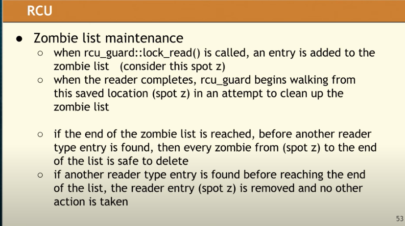

  * ```c++
    struct zombie_list_node {
      atomic<zombie_list_node*> next;
      node *zombie_node;
      atomic<rcu_guard*> read_in_process; // 第四步中的remove entry是将该指针置nullptr
    }
    ```

  * 这里reader执行了reclaim memory，会对性能有些影响：Fedor Pikus 48:52

## [Alisdair Meredith “Recreational C++”](youtube.com/watch?v=ovxNM865WaU&list=PLHTh1InhhwT6bwIpRk0ZbCA0N2p1taxd6&index=50)

* 过了下`std::is_function, std::is_arithmetic`的实现

* [Eric Niebler](https://stackoverflow.com/questions/43470741/how-does-eric-nieblers-implementation-of-stdis-function-work)的实现。挺有意思的，但是有bug：an array of incomplete class会被错误识别为function

  * ```c++
    // 使用priority_tag来进行tag_dispatch. 派生类比基类可用范围更窄，即SFINAE优先级更高
    // 这样可以实现函数重载的优先级顺序
    // 函数签名为char (xx) [#],即返回类型为char[#]. 这样后面就可以通过sizeof进行判断
    // decltype((*(T*)0)[0])等价于std::declval<T>()[0], 或者std::is_array<T>
    //    * 前者需要多敲写代码（？个人感觉还短些）
    //    * 后者的话会导致实例化一个模板，可能导致代码膨胀
    //    * 字面意思是：将0强转为T*, 然后deref,庵后index
    
    template<int I> struct priority_tag : priority_tag<I - 1> {};
    template<> struct priority_tag<0> {};
    
    // Function types here:
    template<typename T>
    char(&is_function_impl_(priority_tag<0>))[1];
    
    // Array types here:
    template<typename T, typename = decltype((*(T*)0)[0])>
    char(&is_function_impl_(priority_tag<1>))[2];
    
    // Anything that can be returned from a function here (including
    // void and reference types):
    template<typename T, typename = T(*)()>
    char(&is_function_impl_(priority_tag<2>))[3];
    
    // Classes and unions (including abstract types) here:
    template<typename T, typename = int T::*>
    char(&is_function_impl_(priority_tag<3>))[4];
    
    template <typename T>
    struct is_function
        : std::integral_constant<bool, sizeof(is_function_impl_<T>(priority_tag<3>{})) == 1>
    {};
    
    // 另一个版本, 函数指针不能是const、也不能是ref
    template<typename T>
    constexpr bool is_func_v = !is_const_v<const T> and !is_reference_V<T>;
    
    //// is_arithmetic ////
    // 对于arithmetic类型，无法重载unary +
    template<typename T>
    void operator+(T);
    
    template<typename T, typename = void>
    constepxr bool is_arithmetic_v = false;
    
    template<typename T, 
    	void_t<
        decltype(+T{})& // 对于可用重载的，这里返回类型为void, void不能&
        decltype(T{} * T{}) // filter: pointer or array
        decltype(T{} % 1) // filter: float
      >
    >
    constepxr bool is_arithmetic_v = true;
    
    //// get ////
    template<typename ...>
    struct tuple_imp;
    
    // 这里index_sequence的签名和std的不符合呀，是不是ppt里有笔误
    // 之所以要wrap<Index, Types>而不是直接Types是因为可能有重复的类型，但基类不能重复
    template<size_t ...Index, typename ... Types>
    struct tuple_imp<index_sequence<Index..., Types ...> : wrap<Index,Types>... {};
    
    template<typename...Types>
    struct tuple : tuple_imp<index_sequence_for<Types...>, Types...> {};
    
    template <size_t N, typename T>
    struct wrap { ...operator() ...{return value;} };
    
    template <size_t N, typename N>
    constexpr auto access(Wrap<N, Type> &x) noexcept -> Type & {return x;}
    
    template <size_t N, typename ...Types>
    constexpr auto get(Tuple<Types...> &x) noexcept -> tuple_ement_t<N, Tuple<Types>> & {
      return access<N>(x);  // 注意，这里通过引用切到了基类
    }
    ```

## [Tony Van Eerd “Postmodern C++”](youtube.com/watch?v=QTLn3goa3A8&list=PLHTh1InhhwT6bwIpRk0ZbCA0N2p1taxd6&index=58)

* 说实话不是特别明白在说啥，但是押韵挺有意思的——主要是思想方式
* 代码要注重isolation。比如代码抽成函数，让我们更聚焦当前这小部分逻辑
* 代码的一些抉择取决于context与对象。比如error handling虽然有exception、error code、logging、termination、user message等方法。但用哪一个取决于你要交流的对象，比如library author、calling developer还是end user。

## [Jason Turner “Practical C++17”](youtube.com/watch?v=nnY4e4faNp0&list=PLHTh1InhhwT6bwIpRk0ZbCA0N2p1taxd6&index=58)——一些新特性的介绍

* structure binding、if/switch init、fold expression、if constexpr、string_view、emplace_back
* noexcept现在是类型签名的一部分，类似const
* NRVO无法用于subobject，即pair<int, string> 在返回.second时需要加move，否则直接return会有copy。structure binding不能解决这一问题。

## [Titus Winters “Hands-On With Abseil”](youtube.com/watch?v=xu7q8dGvuwk&list=PLHTh1InhhwT6bwIpRk0ZbCA0N2p1taxd6&index=60)

* 避免使用过长的namespace。从可读性上来说，最好只有1层；另外，名字应更具可读性——比如`foo::file::SetContents -> boo::SetFileContests`

## [John Lakos “Local ('Arena') Memory Allocators](youtube.com/watch?v=nZNd5FjSquk&list=PLHTh1InhhwT6bwIpRk0ZbCA0N2p1taxd6&index=74)

* pmr可以让不同alloctor的对象放在一个容器、函数里。即不影响类型系统
* vitual和inline语义上有些矛盾。因此，对于按指针访问时，inline会被忽略掉；但如果按对象访问，则是inline替换
* Density, Variation——维度补充下
  * D+V  benchmark在高Utilization、无多线程Contention时: globle > Multipool > multipool<Mono> > Monotonic
  * Locality: 如果多个线程，不断地从一个线程pop并push到另一个线程，会导致diffusion，即不同线程的memory交织在一起，cache不友好、且会出现false sharing。如果缺少local分配器时，会出现这种情况
    * 
    * 这个和fragement不一样，内存碎片是内存散落在各处，无法有效利用
    * 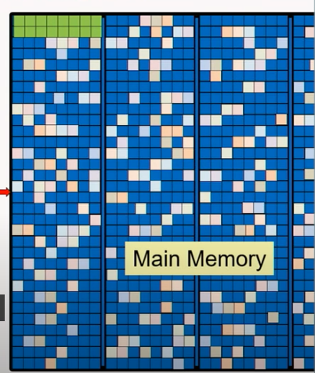
    * 解决办法是使用thread local的对象池。另外，可能要考虑数据copy，避免slice（例子里是list）导致需要访问的内存分在在各处


## [Hartmut Kaiser “The Asynchronous C++ Parallel Programming Model”](youtube.com/watch?v=js-e8xAMd1s&list=PLHTh1InhhwT6bwIpRk0ZbCA0N2p1taxd6&index=89)

* 影响并发的因素——SLOW
  * Starvation: 计算任务偏少
  * Latencies: 比较典型的就是IO
  * Overhead: 串行执行时不会有的开销，比如调度
  * Waiting: 比如竞争，join
* Rule
  * Parallelize as much as humanly possible
  * Embraces SLOW
    * S加计算、L做些别的事、W粗排的流式召回
    * O：在写并发时，要考虑overhead，不能一股脑全并发出去
  * allow for your grainsize to be variable——便于尝试
  * oversubscribe and balance adaptively——这样可以避免Starvation，不过也要注意别提交太多
* 解决办法
  * futurize。从并发一堆thread然后wait_all改为when_all，并进一步改为协程co_await来优化等待？45:00

## [David Sankel “So, you inherited a large code base...”](youtube.com/watch?v=B2XtqVZcSdM&list=PLHTh1InhhwT6bwIpRk0ZbCA0N2p1taxd6&index=97)

* principle pitfalls for large projects
  * 假设
  * distraction——不要为细节所障目，要考虑ROI
  * neophilia——要因地制宜
  * lack of follow through——要做就要做到底，无法坚持到底的改动会导致Frankenstein's monster——如果要中止，一定要恢复原状。half-done损害更大
* 解决办法：
  * Day1: New code必须有高质量（UT、CR、文档），不能引入新的技术债
  * Day1.5: format the code base
  * mnemonics methods：故事化的表述便于文档的理解
  * choose priorities wisely：考虑难易度、先易后难建立信心、考虑业务价值、考虑长远发展
  * migration path: 小步快跑，时间规划、业务价值
  * replacing a piece：划定边界、根据现有代码做好测例、替换旧代码

## [Andreas Weis “Howling at the Moon: Lua for C++ Programmers”](youtube.com/watch?v=pfwHCiP1HFM&list=PLHTh1InhhwT6bwIpRk0ZbCA0N2p1taxd6&index=103)

* 一个lua的简介

## [Matt Kulukundis “Designing a Fast, Efficient, Cache-friendly Hash Table, Step by Step”](https://www.youtube.com/watch?v=ncHmEUmJZf4&list=PLHTh1InhhwT6bwIpRk0ZbCA0N2p1taxd6&index=105)

* 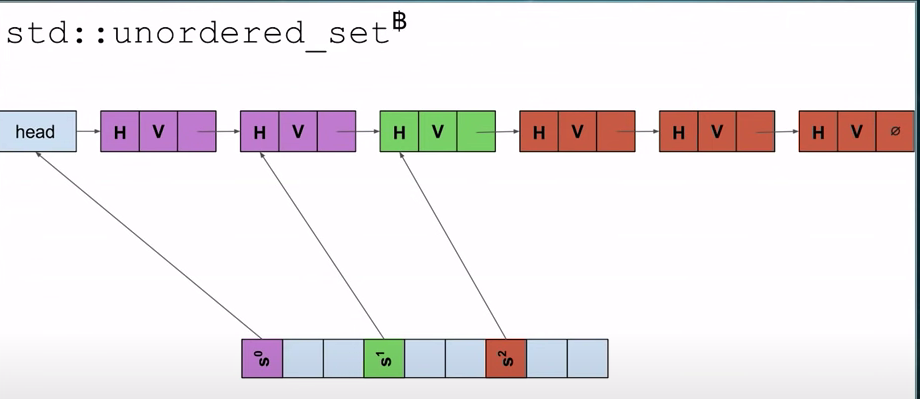

* std基于拉链法实现，但为了便于O(N)遍历，会存下个bucket的指针，并且[x]指向的是上一个元素

  * 之所以要指向上一个元素，或者进一步，改成一个在头部的dummy node，主要是为了便于向拉链中插入元素（插入元素要改的是上个元素的next）。而插入元素最好是在链表的头部插入，以避免遍历到尾部的开销。所以需要一个在链表头部的dummy node

* 一些调整与tradeoff

  * 如果不存到下个链表的指针：减少存储，但会导致全量迭代退化到O(bucket)。如果对一个大map进行clear后，就算只insert了几个val，迭代遍历的时间也会很长

  * 如果不存H：取决于具体类型，主要是find时要重新计算

  * 如果从拉链改为probing：cache友好。不过有了tomb之后，元素的删除会是个问题，一直留着可能导致size很小，但是capacity很大。另外，需要两个特殊值：tomb+sentinel

    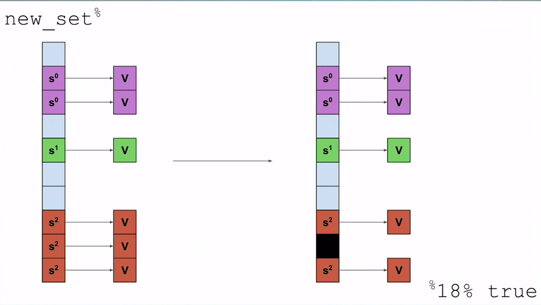

* Cache 友好：——flat_hash_set

  * 为了应对sentinel和empty这两个特殊的hash，不需要把64位hash都读进来。可以分成两部分57+7，这样用一个控制位bit来表示sentinel和empty。可以在一个cache line中塞进更多信息：之前是直接读v进行比较，现在是先读个小的ctrl_bit。如果是find-miss情况下，优势会比较明显
  * 数据改为两个并行存储的array：vector<V> 和vector<hash_2>（1+7bit），并用hash_1作为下标——1维数组在考虑内容的bit表示时，就是个二维bit数组
  * 49:10 提到未实现的想法：因为特殊的hash其实只要1个bit，所以可以做下聚合，将多个node的hash放到一块儿，做些排列，刚好能凑到64B
  * 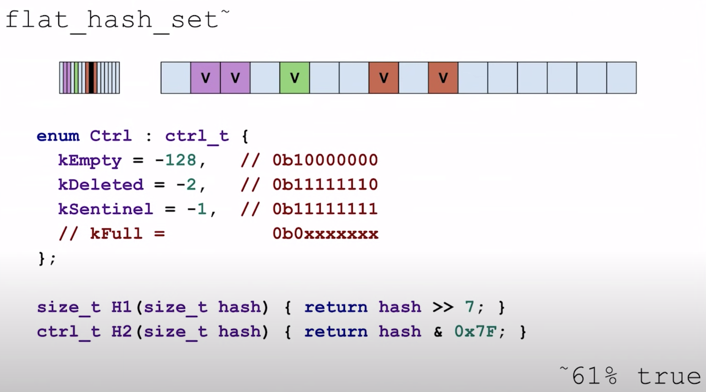
  * 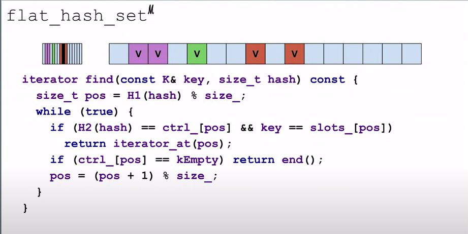
  * 这里可以用assemble进行并行化加速。简单来说，通过set_epi初始化一组要查找的值，然后用cmpeq_epi并行化比较，最后用movemask_epi将mask压缩进若干bit里
  * 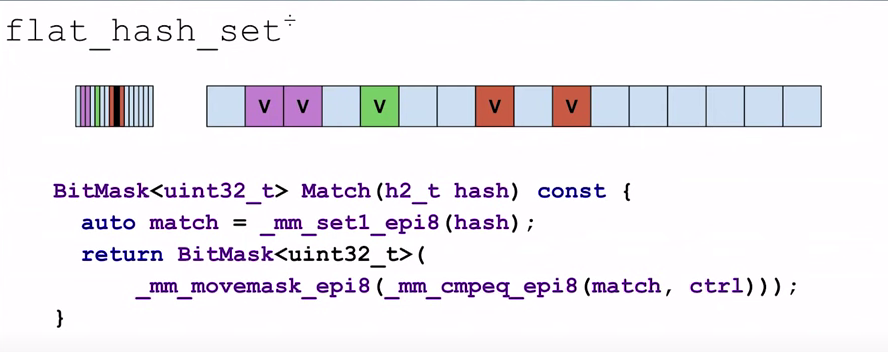
  * predict加速
  * 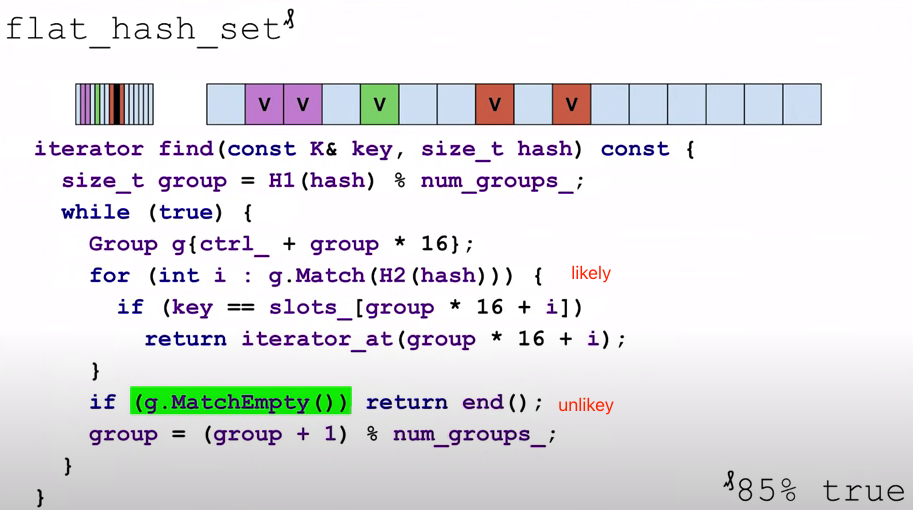

* 

  ```c++
  // ## map在c++14支持了heterogeneous look-up, unordered_map要到c++20。另外，string得自己实现，标准库里的hash好像没有加transparant
  // 简言之——要么提供heterogeneous lookup，要么提前构造下对象
  const char key1[] = "asdasdasdasd";
  const string key2 = "asdasdasdasd";
  while (iters--) m.find(key1);  // slow
  while (iters--) m.find(key2);  // fast
  
  
  
  // ## const 导致的重载问题，gcc的find、emplace等接口会导致临时对象的构造——clang似乎没这问题
  // cp更快: p命中的是③. gcc的实现：内部会构造一个临时的key；clang貌似没这个问题
  // pair insert(const value_t&);  		①
  // pair insert(value_t&&);					②
  // template<typename P> pair insert(P&&value)	③
  // 简言之——pair记得加const
  auto m = unordered_map<string, int>{};
  auto p = pair<const string, int>{};
  auto cp = const pair<const string, int>{};
  while (iters--) m.insert(p); // slow
  while (iters--) m.insert(cp);  // fast
  
  // ## 类似的, gcc会有个临时的node构造出来（即使该key已存在）。clang似乎没这个问题
  // 简言之——如果可以，尽量用insert而不是emplace
  const string key= "";
  while (iters--) m.emplace(key, 0);  // slow
  while (iters--) m.insert(cp);  // fast
  
  // ## std::hash<int>(val)的结果就是val
  ```


## [Nicholas Ormrod “Fantastic Algorithms and Where To Find Them”](youtube.com/watch?v=YA-nB2wjVcI&list=PLHTh1InhhwT6bwIpRk0ZbCA0N2p1taxd6&index=106)

* 一些算法。算法不一定要知道怎么实现，但是要知道有这么个算法，并在需要时使用
* heavy hitters
* morris traversal。
  * 用unique_ptr管理subnode时，对于unbalance tree，析构可能导致stack overflow。（std::map没有这个问题，因为是平衡的，所以height是logN，一般不会有问题）
  * 如果只有right，尾递归可以优化掉堆栈。顺带说下，gcc -O2（clang -O1?）时会进行尾递归优化。感觉没必要手写尾递归
  * 如果有left，需要考虑如何遍历left。这个时候可以考虑morris traversal
* HyperLogLog
  * hash使得每个bit随机置为1
  * 计算leading zeros
  * 为了避免波动，分组+加权平均。将hash分为两截，前半截做数组下标，后半截计算leading zeros
  * 减少极端值的影响，加权平均改为调和平均

## [Tony Van Eerd “An Interesting Lock-free Queue - Part 2 of N”](youtube.com/watch?v=HP2InVqgBFM&list=PLHTh1InhhwT6bwIpRk0ZbCA0N2p1taxd6&index=114)

* ```c++
  using Val = int;
  static constexpr Val kEmpty = 0;
  struct GenI {
    Val data;
    int generation;
  };
  // 左边的gen比右边的大，当前gen的val：0一定在左边(pop后才会有0，非零是push后才有)
  // 0 0 y x x
  // 5 5 5 4 4
  class Queue{
    atomic<GenI> buffer[SIZE];
    laxtomic<GenI> headish; // hint，并非代表head的确切值，所以是relaxed
    laxtomic<GenI> tailish; // hint，并非代表tail的确切值，所以是relaxed
  };
  
  bool is_zero(GenI entry, int gen) {
    return entry.data == kEmpty && entry.gen == gen;
  }
  void incr(GenI &tmp, int &gen) { // wrap
    if (++tmp == SIZE) {
      tmp = 0;
      ++gen;
    }
  }
  
  bool push(Val v) { // 1:04:44
    int pre_gen = 0;
    GenI entry;
    GenI tmp;
    GenI old = tmp = tail;  // laxtomic load
    do {
      entry = buffer[tmp].load(relaxed);
      // compare with gen
      // 0 |0| y x x
      // 5  5  5 4 4
      while (!is_zero(entry, tmp.gen)) {
        if (entry.gen < pre_gen) {
          //   p  e
          // x x |x| x x
          // 5 5 |4| 4 4
          while (!tail.CAS(old, tmp) && old < tmp) {}  // update tail
          return false; // full
        }
        
        tmp.incr();
        if (entry.data) {
          pre_gen = entry.gen;
        }
      }
      GenI newg{val, tmp.gen};
      // in case of other thread updated tail
    } while(!buffer[tmp].CAS(entry, newg, release));
    tmp.incr(); //go to next
    // update if no one else has gone as far
    while(!tail.CAS(old, tmp) && old < tmp) {}
    return true;
  }
  
  Val pop(){
    int pre_gen = 0;
    GenI entry;
    GenI tmp;
    GenI old = tmp = tail;  // laxtomic load
    do {
      entry = buffer[tmp].load(relaxed);
      while (entry.is_data(tmp.gen)) {
        if (entry.gen == pre_gen) {
          while (!head.CAS(old, tmp) && old < tmp) { }
          return 0; // empty
        } else {
          tmp.incr();
        }
      }
      GenI zero{kEmpty, tmp.gen + 1};
    } while(!buffer[tmp].CAS(entry, zero, acquire));
    tmp.incr(); //go to next
    // update if no one else has gone as far
    while(!head.CAS(old, tmp) && old < tmp) {}
    return entry.val;
  }
  ```


## [Pablo Halpern “Allocators: The Good Parts”](youtube.com/watch?v=v3dz-AKOVL8&list=PLHTh1InhhwT6bwIpRk0ZbCA0N2p1taxd6&index=121)

* 尽量使用`polymorphic_allocator<byte>`19:36

* ```c++
  // 使用匿名union来避免初始化
  template <typename T>
  struct node: node_base<T> {
    union {
      T value_;
    }
  };
  
  template<typename Tp>  // 47:05
  template<typename ...Args>
  auto slist<Tp>::emplace(iterator i, Args&& ..args) -> typename slist<Tp>::iterator{
    auto *new_node = static_cast<node*>(allocator_.resoource()->allocate(sizeof(node), alignof(node)));
    allocator_.construct(addressof(new_node->value_), forward<Args>(args)...);
    // ...
  }
  
  // 一些总结58:00
  ```


## [Klaus Iglberger “Free Your Functions!”](youtube.com/watch?v=WLDT1lDOsb4&list=PLHTh1InhhwT6bwIpRk0ZbCA0N2p1taxd6&index=124)

* SOLID
  * Single responsiblity principle
  * Open-close principle
  * Liskov substitution principle——子类能替换基类。子类能扩展基类，但是不能改变基类原有的功能
  * Interface Segreation principle——接口不要糅在一起，避免臃肿
  * Dependency Inversion principle——高层次不依赖底层实现细节
* static member function ->namepsaced free function。根据情况逐渐调整。如果多个地方都用到了，就弄成free，不然就static member function。后者感觉对IDE补全之类的好些
* 有以下好处
  * 更好的封装——成员函数的this能访问所有数据。另外，自由函数意味着能挪到.cpp里
  * 更解耦、易于测试（#define private public）
  * 更易于扩展、复用
  * 更好的性能——为了调用obj.func，我们必须构造个obj
* 例子
  * std::begin，std::real 

## [Louis Brandy “Curiously Recurring C++ Bugs at Facebook”](youtube.com/watch?v=lkgszkPnV8g&list=PLHTh1InhhwT6bwIpRk0ZbCA0N2p1taxd6&index=125)

* shared_ptr is not thread-safe. 24:00

  * [std::shared_ptr thread safety](https://stackoverflow.com/questions/14482830/stdshared-ptr-thread-safety?noredirect=1&lq=1) stackoverflow

* 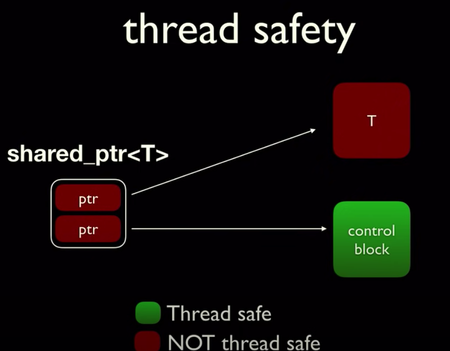

* ```c++
  // 不在shared_ptr保护范围
  auto& ref = *return_a_shared_ptr();
  ref.boom();
  
  // 声明了一个变量foo。之所以会支持这种声明，是为了便于解析 (*x)[2]  or  void (*foo)()
  // almost always auto可以避免
  // 如果一个xx可以是declaration or definition，那它是declaration 36:00
  string (foo); // 临时变量foo
  string ("123"); // 匿名变量
  unique_lock<mutex> (mutex_); // shadowing, 不是成员变量mutex_，而是一个局部变量。
  
  ```

## [Chandler Carruth “Going Nowhere Faster”](youtube.com/watch?v=2EWejmkKlxs&list=PLHTh1InhhwT6bwIpRk0ZbCA0N2p1taxd6&index=126)

* ```c++
  
  static void BM_CppCon2017(benchmark::State &s) {
    auto const bytes = (1 << s.range(0)) * 2 / 3;
    int32_t const count = bytes / sizeof(int) / 2;
  
    auto rd = std::random_device{};
    auto dist = std::uniform_int_distribution<int32_t>(
        numeric_limits<int32_t>::min(), numeric_limits<int32_t>::max());
    auto rd1 = std::random_device{};
    auto dist1 = std::uniform_int_distribution<int32_t>(0, count);
  
    auto v = std::vector<int>(count);
    for (auto &i : v) {
      i = dist(rd);
    }
    auto v2 = std::vector<int>(count);
    for (auto &i : v2) {
      i = dist1(rd1);
    }
  
    for (auto _ : s) {
      int64_t sum = 0;
      for (int i : v2) {
        sum += v[i];
      }
      benchmark::DoNotOptimize(sum);
    }
    s.SetBytesProcessed(int64_t(s.iterations()) * bytes);
    s.SetLabel(std::to_string(bytes / 1024) + " KB");
  }
  BENCHMARK(BM_CppCon2017)->DenseRange(13, 26)->ReportAggregatesOnly(true);
  // BM_CppCon2017/13        499 ns          499 ns      1402078 bytes_per_second=10.1831G/s 5 KB
  // BM_CppCon2017/14        992 ns          992 ns       704947 bytes_per_second=10.2564G/s 10 KB
  
  //// 设置最小运行时间
  // ./cache_bench --benchmark_filter=BM_CppCon2017/16 --benchmark_min_time=2s
  //// 发现对于case16，25.24%fronted cycles idle，即cpu有空闲。而case15只有2.75% 18:22
  // perf stat ./cache_bench --benchmark_filter=BM_CppCon2017/16 --benchmark_min_time=2s
  //// 下钻分析L1-icache, L1-dcache
  // perf stat -e L1-icache-loads,L1-icache-load-misses,L1-dcache-loads,L1-dcache-load-misses ...
  //// 
  
  ```

  | case | fronted cycles idle | L1-dcache-load-misses | Thru/kb       |
  | ---- | ------------------- | --------------------- | ------------- |
  | 15   | 2.75%               | 0.01%                 | 18.3GB/s,32kb |
  | 16   | 25.24%              | 0.04%                 | 17.2GB/s,64k  |

* cpu会做预测

* 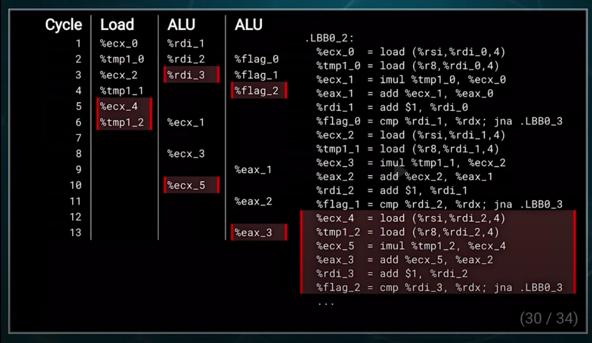

## [Louis Dionne “Runtime Polymorphism: Back to the Basics”Louis Dionne “Runtime Polymorphism: Back to the Basics”](https://www.youtube.com/watch?v=gVGtNFg4ay0&list=PLHTh1InhhwT6bwIpRk0ZbCA0N2p1taxd6&index=137)

* ```c++
  // 小对象优化 18:14
  struct Vehicle {
    union {
      void *ptr_;
      std::aligned_storage_t<32> buffer;
    };
    bool on_heap_ = false;
  
    template <typename Any>
    Vehicle(Any) {
      if constexpr (sizeof(Any) > 32) {
        ptr_     = new Any();
        on_heap_ = true;
      } else {
        new (&buffer) Any();
        on_heap_ = false;
      }
    }
  
  };
  
  ```

* 如果存储的数据都是相同的，从heap改为local存储数据并不一定就会快。43:00

  * 有可能是cacheline。改为local后，容易cache miss
  * intel platform：有reordering。non-local存储虽然有extra indirection，但是如果这个地址已经resolved，其实没有什么开销
