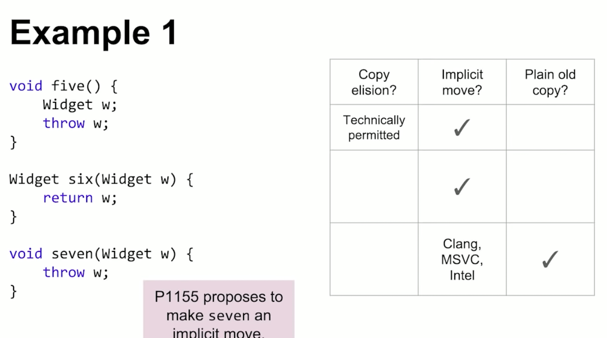

[toc]

## 一些杂想：

* c++的default是错误的，所以我们从代码规范、新特性方面进行了各种限制，来表达我们的想法
  * 代码规范：初始化、const、override
  * 默认by value传值
* c++17主要聚焦于易用性、与readability
  * 易用性: fallthrough等attribute、structure binding、if/switch init
  * readability：option、variant、

* 画heap：https://en.cppreference.com/w/cpp/algorithm/ranges/is_heap_until

[toc]


## [CppCon 2018: Kris Jusiak “State Machines Battlefield - Naive vs STL vs Boost”](https://www.youtube.com/watch?v=yZVby-PuXM0&list=PLHTh1InhhwT6V9RVdFRoCG_Pm5udDxG1c)

* 用variant实现state machine。不满足开放闭合原则，但其他方式似乎也有这个问题

* ```c++
  class Connection {
    struct Disconnected {}; // use struct instead of enum, can have data
    struct Connecting {};
    struct Connected {};
    //
    variant<Disconnexted, Connecting, Connected> state = Disconnected{};
    constexpr void process_event(Connect const &) {
      visit(overload{
        	[&](Disconnected) { establish(); state = Connecting{}; },
          [](auto) { } // no changes
  	    }, state);
    }
  };
  //
  // 顺带提一下，gcc8.x的汇编有问题，用到了vtable。9+的是inline的。demo如下
  struct Connect{};
  template <class... Ts>
  struct overload : public Ts... {
    using Ts::operator()...;
  };
  template <class... Ts>
  overload(Ts...) -> overload<Ts...>;
  int main() {
      Connection c;
      c.process_event(Connect{});
  }
  ```

## [CppCon 2018: Chandler Carruth “Spectre: Secrets, Side-Channels, Sandboxes, and Security”](https://www.youtube.com/watch?v=_f7O3IfIR2k)

* terminology：
  * heartbleed: information leak
  * side channel
* 分支预取会更新cache，导致side channel。17:00有个例子，不过不是特别明白
* variant一些变种
  * #1, if-else 可能会走到非预期的分支. 比如篡改了stack信息、vptr之类的。不是很理解，如果会这样的话，代码正确性不就有大问题了么
  * #2，编译器会将一些代码调用做成switch table，其key可能存在hash collision。理论上可以构造处特定的hash值，导致碰撞后走非预期的函数调用
  * #4，speculative bypass。比如`for (auto &[callback, key] :vec) {callback(key); }`可能会导致callback用了上次循环的key
* Nothing to steal，or no one to steal -> nothing to secure
* mitigation
  * prerequisite: you need the OS mitigations
* 杂项：
  * 分支预测对代码的加速有20x。1:20:40
  * 分支预测在被终止前肯能有上百个指令。1:22:24

## [CppCon 2018: Fred Tingaud “A Little Order: Delving into the STL sorting algorithms”](https://www.youtube.com/watch?v=-0tO3Eni2uo&list=PLHTh1InhhwT6V9RVdFRoCG_Pm5udDxG1c&index=10)

* 对于N个元素，我们只排序前k个。——partial_sort居然比sort耗时多了约50%，nth_element+sort只有全局sort的50%，我们来看看为什么
* 复杂度：
  * sort：O(N)；
  * partial_sort：O(N * log(k))。即意味着partial_sort复杂度有两个自由度：
    * 如果是找中位数，k=N/2，复杂度为O(N * log(N))
    * 如果是在海量数据里找top10，则复杂度为O(N)
  * partial_sort vs nth_element_sort: O(N * log(k)) vs O(N + k * log(k))
  * 所以当k很小时，建议使用partial_sort，当k较大时，使用nth_element_sort——14:11
    * 举例：log按log10处理，以N=10e4：
    * k = 10: partial vs nth: N vs N + 10, partial胜出
    * k = N/10: partial vs nth: N(logN - 1) vs 0.9N + 0.1N * logN, nth胜出

## [Bob Steagall “Fast Conversion From UTF-8 with C++, DFAs, and SSE Intrinsics”](https://www.youtube.com/watch?v=5FQ87-Ecb-A&list=PLHTh1InhhwT6V9RVdFRoCG_Pm5udDxG1c&index=16)

* 一个关于utf-8转换的DFA实现。条例蛮清晰的
* 实现
  * step 1. 使用lookup table做DFA的状态跳转
  * step 2. 优化：ASCII避免查找
  * step 3. 优化：输出是32bit的，所以对于ASCII可以进行并行，SSE
  ```
  // 45:50.  1:06:00似乎提到汇编代码AVX能更高效的一些
  zero = _mm_set1_epi8(0);  // 16-bit zero
  chunk = _mm_loadu_si128((__m128i const *) pSrc);  // load
  mask = _mm_movemask_epi8(chunk);  // 最高位bit是否为1的mask
  
  half = _mm_unpacklo_epi8(chunk, zero);  // 拼接：ab cd -> a0 b0 c0 d0
  qrtr = _mm_unpacklo_epi16(half, zero);  // 拼接：a0 b0 -> a0 00 b0 00
  ```

## [Steven Simpson “Source Instrumentation for Monitoring C++ in Production”](https://www.youtube.com/watch?v=0WgC5jnrRx8&list=PLHTh1InhhwT6V9RVdFRoCG_Pm5udDxG1c&index=19)

* 什么时候是production ready?: observable
* instrument的好处
  * monitor, measure performance, diagnose error
* logging
  * 建议使用structure logging，因为对后续的日志的处理更友好，避免写一堆regex
  * 细化一点就是tracing了。logging更偏向debug，解决当前问题；tracing更偏向monitor，更偏向应对将来问题
    * begin, end, span
    * 层级递进: `auto t2 = t1.trace(...)`, 并可以和error联合使用，把底层的error和最上层的调用联系起来
* metrics
  * 历史、告警

## [Nir Friedman “Understanding Optimizers: Helping the Compiler Help You”](https://www.youtube.com/watch?v=8nyq8SNUTSc&list=PLHTh1InhhwT6V9RVdFRoCG_Pm5udDxG1c&index=22)

* ⭐️：lambda、by-value、template枚举bool的true、false，39:00
* ```
  // case 1: lambda make things faster。
  // 39:29 因为：传函数指针时，compiler能看到的只是一个value，没有类型信息；传lambda时是有类型信息的，可以进一步优化。
  bool my_cmp(double x, double y) {return x > y;}
  //
  void g(vector<double>& v){
    std::sort(std::begin(v), std::end(v), my_cmp);
  }
  // faster, my_cmp is inline
  void f(vector<double>& v){
    std::sort(std::begin(v), std::end(v), [] (auto x, auto y){
      return my_cmp(x,y);
    });
  }
  //
  // case 2: 不一定更好：虽然平均耗时可能降了，但是在最坏情况下，我们多了一个if的开销；而我们往往更关心这种长尾耗时
  int fast_modulues(int x, int m) {
    if (x < m) return x;
    return x % m;
  }
  //
  // case 3: pass-by-ref 不利于优化. 当by-value传b时，if可以被挪到for外，这样只用比较一次，但是by-ref无法这么做。
  void qux(vector<int> const&x, bool const &b) {
    for (auto e:x) {
      bar();
      if (b) foo(e);
    }
  }
  bool my_bool = true;
  void bar() { my_bool = !my_bool; }
  qux(x, my_bool);
  // 顺带说下，const没有被compiler考虑
  void foo(const int&);
  bool bar(int x) {
    const int y = x+1;
    foo(y);  // 除非改成传值，不然y>x还是会进行比较，而不是返回true
    return y > x;
  }
  ```
* inline是最核心的优化。不仅是因为避免了函数调用，更重要的是compiler能有更多信息去优化。。

## [Jonathan Boccara “105 STL Algorithms in Less Than an Hour”](https://www.youtube.com/watch?v=2olsGf6JIkU&list=PLHTh1InhhwT6V9RVdFRoCG_Pm5udDxG1c&index=32)

* 一个stl的视频
```c++
// inplace_merge, 可以用来做归并排序 c++17

// is_*:        is_sorted,      is_partitioned,       is_heap
// is_*_until:  is_sorted_until,              , is_heap_until

// *_copy: remove/unique/reverse/rotate/replace/partition/partial_sort

// accumulate/(transform_)reduce

// partial_sum/(transform_)[inclusive|exclusive]_scan

// mismatch

// adjacent_find

// fill/generate/iota/replace

// uninitialized_*: fill/copy/move
// destroy
```

## [Greg Law “Debugging Linux C++”](https://www.youtube.com/watch?v=V1t6faOKjuQ&list=PLHTh1InhhwT6V9RVdFRoCG_Pm5udDxG1c&index=38)

* ctl +x +a: 切换到窗口模式
* ctl +x +o: 切换焦点
* ctl +x +1: 显示src
* ctl +x +2: 显示src+asm
* ```bash
  watch foo  				# stop when foo is modified
  watch -l foo 			# watch location
  rwatch foo				# stop when foo is read
  watch foo thread 3 		# stop when thread 3 modifies foo
  watch foo if foo > 10 	# stop when foo is > 10
  
  thread apply 1-4 print $sp # stack pointer
  thread apply all backtrace full
  
  # dprintf location, template, expresion
  dprintf  perf_msgr_client.cc:133,"Test send i = %d，ops = %d,inflight = %d\n",i,ops,inflight
  
  catch catch
  catch syscall 100
  
  gdb reverse-stepi https://sourceware.org/gdb/onlinedocs/gdb/Reverse-Execution.html
  ```

## [CppCon 2018: Simon Brand “How C++ Debuggers Work”](https://www.youtube.com/watch?v=0DDrseUomfU&list=PLHTh1InhhwT6V9RVdFRoCG_Pm5udDxG1c&index=48)

* print vector[5]: `error: call to a function that is not present in the target`似乎可以在代码中`template class std::vector<int>;`来生成定义，这样就可以调用了

## [CppCon 2018: Titus Winters “Modern C++ Design (part 1 of 2)”](https://www.youtube.com/watch?v=xTdeZ4MxbKo&list=PLHTh1InhhwT6V9RVdFRoCG_Pm5udDxG1c&index=55)

* api design atomic: overload sets

* good overload sets

  * correctness can be judged at the call site **w/o** knowing which overload is picked
  * a single comment can describe the full set
  * each element of the set is doing “the same thing”

* mem-function

  * const、ref

    * ```c++
      struct S {
      	S& operator= (const S& rhs) &{};
      };
      S ReturnS() { return {}; }
      ReturnS() = {}; // Error, nonsense. 如果上面没有加&则编译器无法捕捉到
      ```

## [Titus Winters “Modern C++ Design (part 2 of 2)”](https://www.youtube.com/watch?v=tn7oVNrPM8I&list=PLHTh1InhhwT6V9RVdFRoCG_Pm5udDxG1c&index=86)

* 一些要考虑的点
  * thread compatible vs thread safe。都表示在调用时没有data race，不过前者限制了是const，且mutation需要sync，而后者不需要
    * thread safe（good）/ thread compatible（good、default）/ thread unsafe（mostly bad）
  * compatible == / !=
    * what is the logical state of the type
  * order <,>,<=,>=
    * 是全序的还是偏序的
    * ordering depends on the logical state of the type
    * Only define <,>,<=,>= if you are defining an ordering
  * Copyable、movable
  * mutable
  * invariants
  * dependent precondition
    * vec::operator[]默认不越界，optional.value默认has_value

## [CppCon 2018: Stoyan Nikolov “OOP Is Dead, Long Live Data-oriented Design”](https://www.youtube.com/watch?v=yy8jQgmhbAU&list=PLHTh1InhhwT6V9RVdFRoCG_Pm5udDxG1c&index=64)

* OOP的问题：marries data with operations
  * 异构的数据放在一个logical object中，访问一个操作时，会读取冗余信息，cache pollute
* DoD：
  * 数据都被放在一起，减少cache pollute，函数也更简单。6000个OOP对象意味着6000次cache miss。而两个DoD vec（颜色+位置）只有两次cache miss
  * state（即if-else）从object提到了外面，相当于for中的if改为了if中的for：只判断一次。（当然，前提是每个object的分支都一样）
* analysis
  * scalability-多线程环境：
    * OOP：dependencies、data races
    * DoD：数据间相互依赖较少（copy、分为几个独立区间等）
  * testability：OOP需要mock太多类，DoD没有类似问题，但debug比较麻烦，你得区分哪些数据是相关的（`vec_a[i]`和`vec_b[j]`）
  * modifiability：
    * OOP
      * very tough to change base classes
      * data tends to "harden": hassle to move fields arount becomes too big、nonoptimal data layouts stck arount
      * shared object lifetime management
      * easy to do 'quick' changes
* downsides of DoD
  * correct data separation can be hard
  * "quick" modifications can be tough

## [Walter E. Brown “C++ Function Templates: How Do They Really Work?”](https://www.youtube.com/watch?v=NIDEjY5ywqU&list=PLHTh1InhhwT6V9RVdFRoCG_Pm5udDxG1c&index=66)

* Specialization 不参与overload resolution

* ```c++
  // 31:56
  template<class T> void h(T);  		// a
  template<> 				void h(int *);	// b
  template<class T> void h(T*);			// c
  int *p = nullptr;
  h(p);  // call c, b不参与overload resolution。b是a的specialization
  
  template<class T> void h(T);  		// a
  template<class T> void h(T*);			// c
  template<> 				void h(int *);	// b
  h(p);  // call b, b不参与overload resolution。选取的是c，b是c的specialization，命中b
  
  template<class T> void h(T);  		// a
  template<> 				void h(int *);	// b template<> void h<int *>(int *)
  template<class T> void h(T*);			// c
  template<> 				void h(int *);	// d template<> void h<int>(int *)
  h(p);  // call d。 注意b、d的模板参数是不一样的。话说这样容易有坑啊
  ```

* 不建议对function template进行specialization，它与overload的互动很差。40:11

* 如果需要，尽量走overload而不是对function template进行特化。如果必须特化，考虑用helper class包一层，因为class无法参与overload。

## [Nicolai Josuttis “The Nightmare of Initialization in C++”](https://www.youtube.com/watch?v=NIDEjY5ywqU&list=PLHTh1InhhwT6V9RVdFRoCG_Pm5udDxG1c&index=66)

* array 是aggregat。初始化时：

  * w/o initialization elements might have undefined values

  * nested initialization need an addtional pair of braces

  * ```c++
    vector<complex<double>>    v1{{1, 2}, {3, 4}};
    // array<complex<double>, 10> a4{{1, 2}, {3, 4}} error
    array<complex<double>, 10> a5{{{1, 2}, {3, 4}}};
    
    vector<complex<double>>    v2{{1, 2}};  // initializes 1st element
    array<complex<double>, 10> a6{{1, 2}};  // OOPS: initializes 2 elements
    ```

* `atomic<int> x{};`并不会用0或者1进行初始化！53:00

* 尽量避免使用`T a = xx;`，使用`auto a{};`

## [Jason Turner “Surprises in Object Lifetime”](https://www.youtube.com/watch?v=NIDEjY5ywqU&list=PLHTh1InhhwT6V9RVdFRoCG_Pm5udDxG1c&index=66)

* ```c++
  // 由于SSO，这里只会有一次vector的内存分配，string没有
  vector<string> vec{"a", "b"};
  
  // 5次内存分配：
  // initializer_list实现上是一个hidden array，这里有2次
  //    顺带说下，其类型是string而不是const char*。因为vector<string>已经特化了
  // 其类型是const的，所以不能move，所以在构造string时，又有2次
  // 最后1次是vector的
  vector<string> vec{"a long string of char",
  								   "b long string of char"};
  
  // 2次内存分配
  array<string, 2> a{"a long string of char",
  								   "b long string of char"};
  
  // for loop
  // unknown printing. 
  // 注意const &只会延长get_s，而不会递归到get_s().get_data()——只影响初始化
  struct S {
    vector<int> data{1,2,3};
    const auto &get_data() const{return data};
  };
  S get_s() {return S{};}
  int main () {
    for (auto const &v : get_s().get_data()) {
      cout<<v;
    }
  }
  ```

* 最佳实践

* ```c++
  // don't name temporaries
  auto get_first() {
    auto [first, second] = get_pair();
    return first; // bad idea
    // first是entity.first的引用，引用会导致RVO不适用
  }
  
  auto get_first() {
    return get_pair().first(); // good idea
  }
  ```

* 

## [Andrei Alexandrescu “Expect the expected”](https://www.youtube.com/watch?v=PH4WBuE1BHI&list=PLHTh1InhhwT6V9RVdFRoCG_Pm5udDxG1c&index=85)

* 关于exception

* desiderata

  * |                                                              | errno                                                        | special value                                           | except<T,U><br />有点类似optional |
    | ------------------------------------------------------------ | ------------------------------------------------------------ | ------------------------------------------------------- | --------------------------------- |
    | general: learn once use many                                 | ✅                                                            | ❌<br />won't work with surjective functions             |                                   |
    | minimize soft errors; maximize hard erros<br />avoid metastable states | ❌                                                            | ❌                                                       |                                   |
    | allow centralized handling<br />keep error handling out of most code | ✅                                                            | ❌                                                       |                                   |
    | allow local handling<br />library can't decide handling locus | ✅                                                            | ✅                                                       |                                   |
    | trasport an arbitrary amout of error info                    | ❌                                                            | ❌                                                       |                                   |
    | demand little cost on the normal path                        | ✅                                                            | ✅                                                       |                                   |
    | make correct code easy to write                              | ❌<br />error handling entirely optional<br />threading issues | ❌<br />错误处理是可选项<br />错误处理和正常代码混在一起 |                                   |

* ```c++
  // expect<T, U> T代表正常结果类型，U代表except类型。其swap函数比较有有意思
  enable_if_t<is_nothrow_move_constructible_v<T>
    && is_swappable_v<T&>
    && is_nothrow_move_constructible_v<E>
    && is_swappable_v<E&>>
  swap(expected& rhs) {
    if (ok) {
      if (rhs.ok) {
        using std::swap;
        swap(yay, rhs.yay);
      } else {
        rhs.swap(*this);  // 复用下方代码
      }
    } else {
      if (!rhs.ok) {
        using std::swap;
        swap(nay, rhs.nay);
      } else {
        // 这里比较麻烦，另外再placement new前记得调用西沟函数
        // ok = false, rhs.ok = true
        E t{std::move(nay)};
        nay.~E();
        new (&yay) T(std::move(rhs.yay));
        ok = true;
        
        rhs.yay.~T();
        new(&rhs.nay) E(std::move(t));
        rhs.ok = false;
      }
    }
  }
  ```

  

## [Arthur O'Dwyer “Return Value Optimization: Harder Than It Looks”](https://www.youtube.com/watch?v=hA1WNtNyNbo&list=PLHTh1InhhwT6V9RVdFRoCG_Pm5udDxG1c&index=87)

* 为什么返回值和入参相关时无法RVO：函数return slot是在函数调用堆栈上方的，根据这个假定可以做RVO。但如果要返回入参，无法控制其内存位置，导致这个假定无法满足
* 不要返回move(x)。c++会先尝试(N)RVO，不满足时，会自动尝试move(x)，显式写出来会关掉NRVO
* 可能会导implicit move失败的情况的情况：if the first overload resolution fails or was not performed, or **if the type of the first parameter of the selected constructor is not an rvalue reference to the object's type**(possibly cv-qualified), overload resolution is performed again, considering the object as an lvalue
  * slicing：函数返回子类。**the object's type**
  * Converting:
    * 
    * 
    * 

  * example
  * 
  * 
  * 
  * 
  * 
  * 


##  [Kostya Serebryany “Memory Tagging and how it improves C/C++ memory safety”](https://www.youtube.com/watch?v=lLEcbXidK2o&list=PLHTh1InhhwT6V9RVdFRoCG_Pm5udDxG1c&index=94)

* 比ASAN开销小（可以用在生产环境？）。另外有些硬件指令上直接支持。

## [R. Leahy “The Networking TS in Practice: Testable, Composable Asynchronous I/O in C++”](https://www.youtube.com/watch?v=hdRpCo94_C4&list=PLHTh1InhhwT6V9RVdFRoCG_Pm5udDxG1c&index=97)


# 未看，等以后用到再看

* [Mateusz Pusz “Git, CMake, Conan - How to ship and reuse our C++ projects”](https://www.youtube.com/watch?v=S4QSKLXdTtA&list=PLHTh1InhhwT6V9RVdFRoCG_Pm5udDxG1c&index=74)
* 

