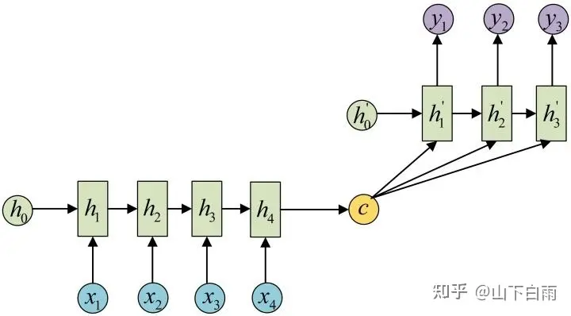
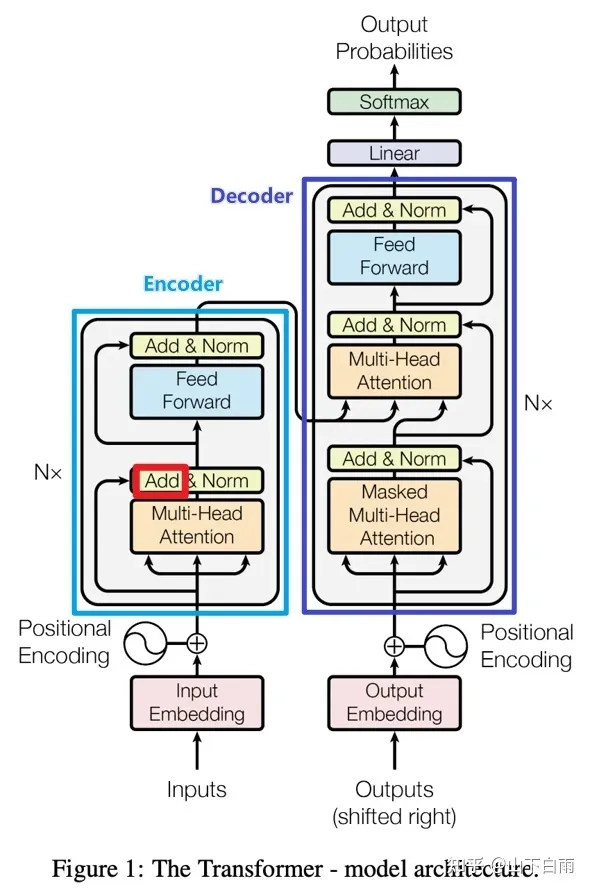
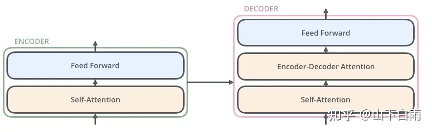
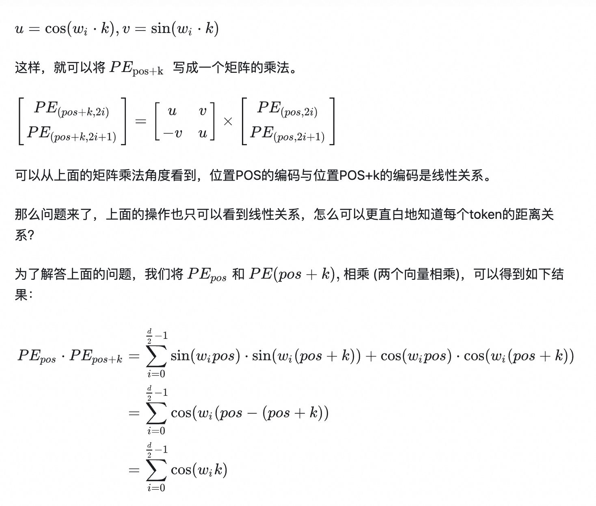

[TOC]

# bert

## RNN

* 1 to 1, 1 to n, n to 1, n to m

* Encoder - decoder: n to m

  * 

* Attention

  * 问题：c的传达的信息有限

  * 不同encoder的 h_i对某个decoder的h'_j的影响不同

  * $$
    \vec{c_t} = \sum^T_{j=1}\alpha_{tj}h_j \newline
    \vec{\alpha_t} = softmax(\vec{e_t}) \newline
    \vec{e_t} = \vec{h_{t_1}}^TW\vec{h}, ...
    $$

* Transformer——https://jalammar.github.io/illustrated-transformer/ 一个比较好的讲解

  * 

  * Self-attention

    * 就是6个 encoder 之间是串行，每个 encoder 中的两个子模块之间是串行，子模块自身是可以并行的
  
    * $$
      Z = softmax(\frac{Q \times K^T}{ \sqrt{d_k}}) V
      $$

  * 
  
  * Multi-head——8组权重矩阵，最后加权平均。
  
    * 增加了可以关注的位置
    * 增加了【表示子空间】
    * 类似把512维的计算分成8个64维的自空间分别计算
  
  * position
  
    * 如何表示位置远近

      * 每个时间步编码唯一
      * 不同长度句子间，任何两个时间步之间的距离一致
      * 能泛化到更长的句子。值有界
      * 是确定性的
  
    * $$
      \vec{p_t} = \left[\begin{matrix}
      sin(w_1 * t) \newline
      cos(w_1 * t) \newline
      ... \newline
      sin(w_{d/2} * t) \newline
      cos(w_{d/2} * t)
      
      \end{matrix}\right] \newline
      w_k = \frac{1}{10000^{2k/d}}  ?
      $$
  
    * 
  
    * 但无法表示先后关系——咋解决？
  
  * 残差模块
  
    * 原因
      * 梯度弥散、梯度爆炸——归一化
      * 网络退化——残差网络。**残差的思想都是去掉相同的主体部分，从而突出微小的变化**。那么**残差结构**有什么好处呢？显而易见：因为增加了一项，那么该层网络对x求偏导的时候，多了一个常数项！所以在反向传播过程中，梯度连乘，也不会造成**梯度消失**！
  
  * 归一化
  
    * **为什么图像处理用batch normalization效果好，而自然语言处理用 layer normalization好？**
  
      CV使用BN是认为不同卷积核feature map（channel维）之间的差异性很重要，LN会损失channel的差异性，对于batch内的不同样本，同一卷积核提取特征的目的性是一致的，所以使用BN仅是为了进一步保证同一个卷积核在不同样本上提取特征的稳定性。
  
      而NLP使用LN是认为batch内不同样本同一位置token之间的差异性更重要，而embedding维，网络对于不同token提取的特征目的性是一致的，使用LN是为了进一步保证在不同token上提取的稳定性。