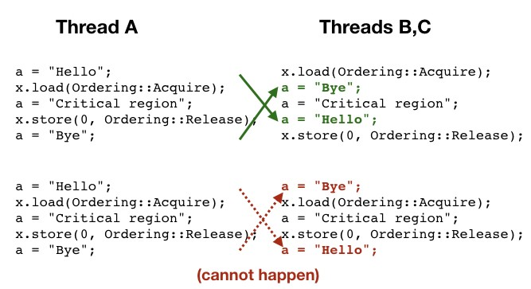

# memory order

* Acquire ：all memory accesses that happen **after** it in the code stay **after** it as visible by all threads
* Release ：all memory accesses that happen **before** it in the code stay **before** it as visible by all threads;
  
* spin lock<mutex<RwLock、
  * spin lock记得用yield，减少消耗cpu资源；(一般较少用，除非不知道啥时候会wake)
* Rc、Cell、RefCell由于有interior mutability，所以不是Send/Sync的


# C++

* 线程传参：参数是copy过去的，到了thread再做处理，比如下面这种要隐式转换，又detach的，是undefined behavior。因为buffer被copy过去后，才转为string，而不是转为string再过去。那么buffer生命周期可能撑不到不了进行隐式转换。

  ```c++
  void f1(std::string);
  void f2(std::string&);
  void oops() {
    char buff[1024];	//....
    string str2;
    thread t1(f1, buffer);	// undefined behavior
    thread t2(f2, str2);	// f2 绑定的是临时对象，而非str2
    t.detach();
  }
  ```

* deadlock：

  * 不只是lock会有，thread也有类似的情况
  * `operation+(A a, A b)` ，a、b都加锁时，会deadlock(假定lock次序是a, b) : threadA:a+b, threadB b+a。使用`std::lock`来同时锁多个锁；不过记得加`lock_guard<, adopt_lock>`或者使用`unique_lock<, defer_lock>`，不过unique虽然有更高的flexible，但是更慢

* unique_lock：适用于defer_lock或者后面要transfer lock的情况。比lock_guard更灵活但更慢更大

* 类的mutex要声明为mutable，以便在const方法中，进行lock和unlock

* 反复同步用cd，one-off的用future。future指向的T是sync的，但future本身是`!Sync+Send`，即不同线程访问同一future需要加同步工作，或者future的thread local的复制。

* [packaged_task vs future](https://stackoverflow.com/questions/18143661/what-is-the-difference-between-packaged-task-and-async)：1、从`async`得到的`~future()`是阻塞的([future内有shared stat，最后一个指向的会block](scottmeyers.blogspot.com/2013/03/stdfutures-from-stdasync-arent-special.html))；2、`packaged_task`可以传递给指定的thread；3、`packaged_task`和`async`相比`thread`，都可以更好地处理exception（`std::nested_exception`可以用于捕捉所有thread的exception？）。

* exception：`std::current_exception`，`copy_exception`

* [compare_exchange_weak vs strong](https://stackoverflow.com/questions/25199838/understanding-stdatomiccompare-exchange-weak-in-c11)。faile有两个情况：spurious failure和concurrent write。只有前者时用strong；要处理后者时用weak

* fence要用于atomic之间，才能对这些atomic产生同步关系

* 并发数据设计guidelines：

  * invariant：不会看见其他thread、也不会被其他thread看见invariant broken的情况
  * API：提供完整的一系列操作，而不是部分的步骤，以避免race condition
  * exception safe
  * dead lock: restricting the scope of locks and avoiding nested locks where possible
  * Lock-free: use `memory_order_seq_cst` for prototyping、注意memory reclamation、identify busy-wait loops and help the other thread

* 代码实践：

  * Lock-based场景：

    * 类似`stack::pop`的接口，在多线程时，可以考虑签名为`bool pop(&T)`或者`shared_ptr pop()`；以及考虑`condition_variable`的pop_wait版

    * `queue`为了能多线程，改为linked list，`next` 和 `head`均为`unique_ptr<T>`，但tail为`T*`；

    * ```c++
      class Node {
        shared_ptr<T> data;	// 便于更新节点时，只是指针赋值、把T的构造放到mutex之外
        uniqu_ptr<Node> next; 
      }
      ```

    * 另外再加入一个`dummy_node`把`head`和`tail`隔开，以便使用两个独立的`mutex`减小加锁力度（不然`push`和`try_pop`可能会访问`head->next`或`tail->next`，而空队列时，`head`和`tail`是相同的，要同时锁上两个锁）。

      ```c++
      std::unique_ptr<node> pop_head()
      {
      	/* get_tail()要在head_mutex中：固定head，对比tail，tail可以向后push，但不会有影响
      	* 不然，如下，固定tail，对比head，head向next走会有问题，此时tail可能已经不在list上了
        node* const old_tail=get_tail();
        lock_guard<std::mutex> head_lock(head_mutex);
        if (head.get() == old_tail) { return nullptr; }
        */
        lock_guard<std::mutex> head_lock(head_mutex);
        if (head.get() == get_tail()) { return nullptr; }
        
        unique_ptr<node> old_head=std::move(head);
      	head=std::move(old_head->next);
      	return old_head;
      }
      ```

    * blocking vs non-blocking; lock-free -> wait-free

      * pro: lock-free在出错时，对其他thread运行没有影响
      * con: 更难写；虽然不会dead lock，但会live lock，且会用到更多atomic——这二者可能会导致性能下降
    
  * Lock-free stack回忆点
  
    * pop为啥只有`shared_ptr<T>`接口——exception safe vs 从list挪下来**后**才进行处理
    
    * 为啥输入`T const&`内部是`shared_ptr<T>`进行存储，并在push中就引入，而不是pop中。——exception safe
    
    * `pop_thread`计数
    
      * 把`node`先存到链表里，当为1时，才delete——高负载时，可能导致永远不会delete
    
    * `hazard ptr`——依赖：`ptr`在对象被释放后，还是可以使用
    
      * 每次拿点前，先设置`hazard ptr`，拿下来后，再`reset`。删除时检查该`node`、之前`node`的`hazard ptr`来进行删除
      * 使用`arrary<pair<thread_id, void*>>`来记录各线程的`hazard ptr`。每个线程用一个`sthread)local static hp_owner`来封装`hazard_ptr`
      * 优化：每`2*max_hazard_pointers`才执行`reclaim` ，但这需要对list长度计数(atomic) ->用`thread_local`，这样可以避免计数（不太明白）。
    
    * node计数
    
      * `shared_ptr` ——如果其是lock-free
    
        ```c++
        struct node {
          std::shared_ptr<T> data;
          std::shared_ptr<node> next;
        };
        std::shared_ptr<node> head;
        ```
    
      * `experimental::atomic_shared_ptr` ——如果`shared_ptr` 不是lock-free
    
        ```c++
        struct node {
          std::shared_ptr<T> data;
          std::experimental::atomic_shared_ptr<node> next;
        };
        std::experimental::atomic_shared_ptr<node> head;
        ```
    
      * `counted_node_ptr`——如果`experimental::atomic_shared_ptr` 无法使用
    
        * 为啥要用internal和outernal两个指针，直接用一个不好么：首先，必须存在一个`atomic`的counter；其次，`increase_head_count`会在while中对counter进行`++`，用`atomic`会有效率问题。因此分为两部分。
    
        ```c++
        struct node;
        	struct counted_node_ptr {	// 需要platform保证2-word-size lock-free
        		int external_count;
        		node* ptr; 
          };
        struct node {
        	std::shared_ptr<T> data;
        	std::atomic<int> internal_count;	//shared_ptr<T> = T* + intern + extern
        	counted_node_ptr next;
        };
        std::atomic<counted_node_ptr> head;
        ```
    
    * lock-free queue回忆点
    
      * 相比lock-free-stack，多了一个问题：push在是在tail，而不像stack是在head。需要`if(old_tail->data.compare_exchange_strong, old_data, new_data.get())` 。而`pop()`可能导致old_tail被释放。
      * push会改tail的data和next，如果其他thread不help，那data到next这个区间是block的，busy wait，需要其他thread去帮忙设置next。
    
  * concurrent design
  
    * 划分——按元素
    
      * 最直接的方法：N元素分到n个桶(thread)，数据相互独立——比如求和
      * 不能事先划分，如快排：限制thread数，然后  `std::async` 出若干个worker，并将job放到 `thread_safe_stack` 上——但stack这里可能会竞争比较激励。
    
    * 划分——按任务
    
      * 不同stage/pipeline；耗时更平滑，但总时间更多——视频处理
      * 不同任务/同任务并行。——耗时不平滑，但总时间更少
    
    * 各种可能对性能影响的factor
    
      * 可用的线程数（spawn过多或过少），其他程序的资源抢占。`std::async`可以避免over submission
    
      * condition/ping-pong cache
    
      * false sharing; 
    
        ```c++
        struct A {
          std::mutext m;
          char padding[std::hardware_destructive_interference_size];
          int my_data;
        }
        ```
    
      * cache line包含了过多的其他数据——更多的cache miss
    
      * task switch——过多的thread导致单个core/core与core之间上，需要切换的cache过多
    
    * 数据结构：少、连续、分散：适当划分，减少元素访问，减少cache大小以减少thread切换开销；尽量连续，增加cache命中；分散以减少false sharing——矩阵乘法
    
    * 考虑到scalable，设计代码时，考虑其扩展性：哪些代码可扩展，哪些会不可扩展；一些耗时的操作，比如I/O，可以async到后台去完成等非
    
  * Thread pool回忆点
  
    * `void ()`：constructor构造n个`thread`，每个`thread`去`try_pop`
  
      ```c++
      std::atomic_bool done;
      threadsafe_queue<std::function<void()> > work_queue;
      std::vector<std::thread> threads;
      join_threads joiner;
      ```
  
    * `T()`：比上一个多了个返回值，需要返回`future`，这需要用到`packeged_task`，但其不是copy-constructable，即`threadsafe_queue<function<packeged_task<T()>>>`不可用，所以不用`function`，而是自定义个`function_wrapper`：`thread_safe_queue<function_wrapper> work_queue`。
  
      ```c++
      class function_wrapper{
        struct impl_base {
          virtual void call()=0;
          virtual ~impl_base() {}
        };
        template<typename F>
        struct impl_type: impl_base {
          F f;
          impl_type(F&& f_): f(std::move(f_)) {}
          void call() { f(); }
        };
      };
      ```
  
    * Work stealing:
  
      ```c++
      class thread_pool {
      	using task_t = function_wrapper;
        std::atomic_bool done;
        threadsafe_queue<task_t> pool_wor_queue;
        vector<unique_ptr<wor_stealing_queue>> queues;
        vector<thrad> threads;
        join_threads joiner;
        static thread_local work_stealing_queue *local_work_queue;	// queues[i]
        static thread_local size_t my_index;
      };
      ```
  
    * Interrupting
    
      * `void interruptible_wait(condition_variable& cv, unique_lock<mutex>& lk)`留意：
        * 在interrupt通知cv时，有race condition——用`set_clear_mutex`保证`set/clear_condition_variable`时不可调用`set`。且这个mutex不能是`lk`，而必须是一个新的`set_clear_mutex`，不然调用interrupt的thread会有dead lock或者dangling lock的问题。
        * wait_for：min(固定时长, interrupt_time)——如果要一直等到cv ok。可以加个while循环。
    
      ~~~c++
      thread_local interrupt_flag this_interrupt_flag;	// p.set_value(&this_thread_interrupt_flag);
      ~~~
    
      
  